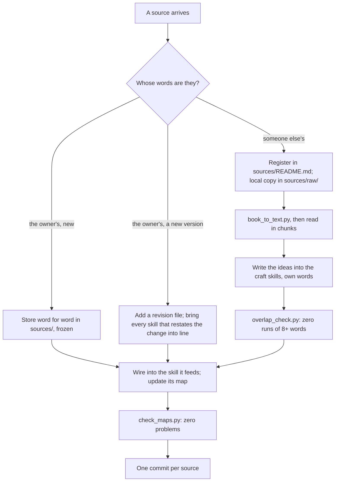

# Add a source

The workshop's craft skills are only as trustworthy as their sources, and the owner must always be able to tell which words are theirs, which ideas came from which book, and that nothing copyrighted sits in the repository. This skill is the one way in.

## The idea in one example

The owner sends the Bond theory with Egri's *The Art of Dramatic Writing* attached "for more detail on developing characters".

- The Bond theory is the owner's own writing. It goes into `sources/bond-theory.md` exactly as sent, under a heading and a short note on where it came from. From then on it is frozen.
- Egri's book is someone else's and is under copyright. It is registered in `sources/README.md`, read from a local copy in `sources/raw/` that git never sees, and its useful ideas are written into the `character` skill in the workshop's own words. A script then proves no run of 8 words or more was copied.

## Where to look, and when

| You are... | Open | To get |
|---|---|---|
| taking in any source | nothing else: this file | the whole procedure |
| turning an ebook into text to read | `scripts/book_to_text.py` | one plain-text file from an .epub, .azw3 or .mobi |
| checking that nothing was copied | `scripts/overlap_check.py` | every run of 8+ words a file shares with the book |
| checking every skill's map after wiring in | `scripts/check_maps.py` | every module missing from a map, every file path that does not exist, every description over the length limit |
| deciding which skill a source feeds | `sources/README.md`, then the skill's own map | the register, and each skill's "Where to look" table |

**Keeping the map true.** When a script or step is added, add a row to the table and a node to the graph in the same edit.

## The stance

- **The owner's theories come first.** A book adds detail, method and examples. Where it disagrees with an owner theory, the skill follows the theory and records the book's view as a rival, naming a change to a story that would tell the two apart. A book never quietly corrects the theory.
- **Frozen means frozen.** A stored source is never edited, not even to fix a typo. The skills derived from it may be improved at any time; the source may not.
- **Own words means own words.** Not a paraphrase sentence by sentence, which keeps the author's structure and is still copying. Read a section, close it, and write what it lets a writer *do*, in the shape the skill needs.
- **Register before you distil.** An idea whose book is not in the register has no provenance, and the owner cannot check it.
- **Plain words.** Explain any term the first time, then keep that one word for that one thing.

## The procedure

**Step 1 - Decide whose words they are.**
- *The owner's own writing*, new: go to Step 2.
- *A new version of an owner theory*: go to Step 3.
- *Someone else's work* (a book, article, transcript, course notes, a web page): go to Step 4. Treat it as copyrighted unless the owner says otherwise and gives the reason.
If unsure whose words they are, ask. Do not guess.

**Step 2 - Store an owner theory.**
1. File name: `sources/<plain-name>.md`, in lower case with hyphens, named after the theory (`bond-theory.md`).
2. First line: `# <The theory's name>`.
3. Then one italic note saying: who supplied it and when; what it builds on, if the owner said; that it is a frozen source reproduced as supplied; exactly what was added (the heading and this note) and what, if anything, was left out and why (a closing offer such as "want me to test it on a film?" is not part of the theory and is left out, and the note says so); and that craft skills derive from it and do not change it, and a revised version is added as a new revision, not edited in place.
4. A line `---`, then the text exactly as supplied. Keep its headings, tables and emphasis.
5. Add a row to "The owner's theories" in `sources/README.md`.
6. Go to Step 5.

**Step 3 - Add a revision of an owner theory.**
1. Never edit the old file. Add `sources/<plain-name>-revision-<n>.md`, stored as in Step 2, with the note also saying which file it revises.
2. List every sentence in the workshop that restates a claim the revision changes (search the skills for the claim's key words, not just the theory's name).
3. Bring each into line with the smallest edit that carries the change, and point any source reference at the new file. Where the old and new versions disagree about something the revision does not mention, leave it and tell the owner.
4. Update the register. Go to Step 5.

**Step 4 - Take in someone else's work.**
1. **Register it** in "Registered works" in `sources/README.md`: author, full title, the edition actually read, an identifier if there is one, when and why it was supplied (in the owner's words where possible), and which skills it will feed. Overlap check: *pending*.
2. **Make a local copy to read.** Put the file in `sources/raw/`. For an ebook: `python3 .claude/skills/add-source/scripts/book_to_text.py <book> sources/raw/<author-short-title>.txt`. Run `git status` and confirm nothing under `sources/raw/` is listed.
3. **Read it in chunks** of roughly 10,000 to 20,000 words, split at chapter breaks. For each chunk write working notes, in your own words, in a scratch folder outside the repository: each idea, the author's reason for it (or "asserted" or "drawn from examples"), how a writer would use it, and how it stands to each owner theory (agrees, extends, conflicts, no link). Notes are working material and are not committed.
4. **Write the ideas into the skills** they serve, from the notes, not from the book. Put book material in reference modules named for what they help with (`references/building-a-cast.md`), not for the book. Start each module with a line naming its sources. Keep what does work for the skill; a skill is not a summary of the book, and it should never be able to stand in for reading it.
5. **Check for copying.** Run `python3 .claude/skills/add-source/scripts/overlap_check.py sources/raw/<file>.txt .claude/skills sources foundations`. Every span it reports must be rewritten, except the author's own short term names (four words or fewer), titles of works, and names of people and characters. Run it again until the only spans left are those. Then read the modules against the book by eye for close paraphrase, which the script cannot see: a passage that follows the author's sentence order, or a list in the author's order and wording. Have someone other than the writer do this. When the first craft skills were built, most first drafts that the script passed at zero still had such passages, and a second reader found them.
6. **Record the result** in the register: "0 runs of 8+ words (titles and term names only), <date>".

**Step 5 - Wire it in.**
1. In each skill it feeds, add a row to the "Where to look, and when" table and a node to the graph for any new module.
2. Say in the skill how the new material stands to the owner theory it serves: fills in, extends, or rival.
3. Run `python3 .claude/skills/add-source/scripts/check_maps.py` and fix every problem it lists until it reports zero.
4. Commit one source per commit. The message says in one line what the source claims and which skill it feeds, and, for a copyrighted work, that it is registered and distilled, not stored.

## Traps

- **Editing a frozen source.** Even a typo fix. Add a revision or leave it.
- **Committing the book.** Anything under `sources/raw/`, a long quotation, the author's example scenes or dialogue, or a chapter-by-chapter summary. Check `git status` before every commit.
- **Paraphrasing line by line.** The script passes it; it is still copying. Write from notes, in the skill's shape.
- **Letting the book win.** A craft book's rules are mostly drawn from past stories. Mark them so, and keep the owner's theory as the frame.
- **Distilling without registering.** The idea then has no source anyone can check.
- **A module nobody can reach.** A reference file with no row in its skill's map is dead. Add the row or remove the file.
- **Leaving out what was left out.** If you drop anything from an owner text, the note must say what and why.
