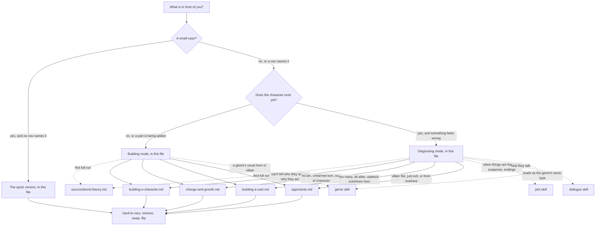

# Character

This skill helps build a character, and find what is wrong with one, by a single measure: whether the audience can stop caring what happens to them. Being liked is not the aim. A character the audience likes and never worries about is not working; one they dislike and cannot look away from is. Care is not a verdict on traits. It is a relationship the story builds, step by step, and this skill gives the writer the steps and a way to find the one that is missing.

**Built on.** The primary source is the owner's Bond theory, `sources/bond-theory.md`. This skill derives from it and does not change it: it turns the theory into steps, questions and tests, and adds examples. Read the full text once per conversation before a first full run. For a small case, or when another skill hands you one question, read only the theory passages cited in the module you open. The skill also draws on the other three theories. From the Anticipation theory (`sources/anticipation-theory.md`): care is the first term of the suspense equation, so it has to be built before the threat arrives. From the Gap theory (`sources/gap-theory-of-narrative.md`): a character is a desire the world has shaped, chasing something the world resists; and, as the Bond theory puts it, care is what makes the Gap theory's gaps worth closing. From the Implied World theory (`sources/implied-world-theory.md`): its indifference principle, flipped; the world shouldn't care about the hero, but the audience must. The reference modules add detail from Egri, Truby and McKee in the workshop's own words. Where a book disagrees with the theory, the skill follows the theory and records the book's view as a rival.

**Words used in one sense only.** The **bond** is the relationship the story builds between the audience and a character; **care** is what it produces: in the theory's words, the audience can't stop caring what happens to them (wanting things for them or against them, fearing for them, missing them). A **rung** is one of the five steps on the theory's ladder of care (Recognise, Understand, Side with, Worry, Miss). A **lever** is one of its ten things a writer can turn up or down (Desire, Vulnerability, Agency, Competence, Decency, Flaw, Interiority, Specificity, Humour, Connection); a capital marks the lever, lower case the ordinary word. A character's **desire** is what they want, specifically, in this story. The **hero** is the character the story follows most closely, good or not; a **lead** is any main character the story gives a line of their own, so the hero is one lead among perhaps several. An **opponent** is anyone the story sets against the hero; a **villain** is an opponent the story presents as doing harm. Whether a villain works is a separate question: the theory's answer is that he works when the audience cares what happens to him, often by badly wanting his downfall.

## The idea in one example

A Thriller draft opens with Dana, a paramedic the narration calls brave, kind and funny, who lost her brother years ago. Test readers say they like her and do not care what happens to her.

Run her up the ladder. *Recognise*: yes, she has a face and a good joke in scene one. *Understand*: no; we never hear her think before the bomb goes off in chapter two. *Side with*: there is nothing to side with, because she wants nothing in particular until chapter four. *Worry*: the bomb threatens everyone in the building equally, so it threatens no one in particular. The brother is told in two lines and never touches a choice: a visible lever, which the theory says feels cheap. And "brave, kind, funny" is the narration ordering care, which audiences resist.

The fix is not more traits. Give her a desire with a date on it (the transfer, decided on Friday, that takes her off night shifts and home to her daughter). Give her a flaw that costs her: she will not hand over a patient she has started on, and it has already got a colleague disciplined. Put one early scene inside her head, and one person who loves her and pays for her flaw.

Then test with `hard-to-vary`. Swap Dana for her partner in the scene where they find a trapped child. Before the fix, nothing changes: she was a list of labels. After it, the partner would hand the child to the fire crew and make Friday's interview; Dana cannot, and that choice is where the reader's worry lives. A trait that changes what she does at a named moment is held in place; a detail that tells the audience something about her they use later is held by that; one that does neither is decoration.

## Where to look, and when

This file holds the method: building a character, diagnosing one, and the quick version. The modules add depth from the books. Open one only when its row applies.

| You are... | Open | To get |
|---|---|---|
| building or diagnosing a small case that no row below names | nothing else: "The quick version" below | three questions |
| about to do a first full run in this conversation | `sources/bond-theory.md`, in full | the ladder, the seven principles, the ten levers and where each breaks, the limits of care |
| building a person from the inside: body, place in society, mind, flaw and need, desire, ghost, values | `references/building-a-character.md` | what shapes a character, how each part shows through behaviour, which lever it feeds |
| planning a change, or the complaint is "no arc", "unearned", "out of character", "she didn't learn anything" | `references/change-and-growth.md` | the seed, the steps between start and end, will and pressure, the self-revelation, heroes who do not change |
| designing a cast, or the complaint is "too many characters", "they blur together", "the sidekick outshines the hero" | `references/building-a-cast.md` | characters defined against each other, roles in the story, contrast, cutting, the small inner circle |
| designing an opponent or villain, or the complaint is "my villain is flat", "just evil" or "came from nowhere" | `references/opponents.md` | the best opponent for this hero, a person and not a function, the levers villains use, the ladder pointing the other way |
| testing whether a trait, a ghost (a past event still driving them) or a scene is doing work | `.claude/skills/hard-to-vary/SKILL.md`, and section 5 of its `references/by-domain.md` | remove, swap, flip, and what holds a choice in place; how heavily to use it: Building, Step 8 |
| finding the problem is when the audience learns something, or suspense, or the ending | `.claude/skills/plot/SKILL.md`; for suspense `.claude/skills/plot/references/suspense-and-fear.md` | the schedule of knowledge, the other terms of the suspense equation |
| finding the problem is how the character talks | `.claude/skills/dialogue/SKILL.md`; for voice `.claude/skills/dialogue/references/voice.md` | what each line does, subtext, a voice nobody else has |
| finding the hero or villain reads as a genre's stock type, or asking what a genre's audience expects of its hero | `.claude/skills/genre/references/genres/<genre>.md`, section 5 (section 8 for where that genre's care comes from) | the genre's usual hero and opponent, and the levers it leans on |

When a small case matches a specific row, open that row's module; the quick version is for a small case no row names.

**Keeping the map true.** When a module is added, split or changed, update the table and the graph in the same edit. A module with no row is unreachable: give it a row or remove it.

**What belongs in this skill.** One test for any addition: does it help build the audience's bond with a particular person in the story, or find where that bond breaks? Craft advice that passes the test belongs here even if a book offers it; advice about plot order, talk or setting goes to the skill that owns it. When in doubt, leave it out and say why.

## The stance

- **Care, not liking.** Ask whether the audience can stop caring, never whether they approve. Alignment beats virtue: we side with whoever we spend time with and understand, often whatever they have done.
- **Traits ease or block; they do not make care.** Time together, access to the mind, understanding the want and fearing the loss make it. A trait counts only when it makes this person act differently from how someone else would at a named moment, or reveals something the audience uses to recognise or understand them.
- **Balance, do not max.** Three or four levers carry a character. When one is turned down, another goes up. Every lever pushed to the top gives a bland saint or a power fantasy.
- **Show, never order.** Narration or other characters telling the audience to admire someone makes them resist. They believe what they see.
- **Indifference is the enemy, for villains too.** The opposite of care is not hate. A villain fails by being a function, not by being disliked.
- **The theory leads; the books fill in.** Most book rules are fitted, drawn from past stories: patterns to question, not laws. Where one disagrees with the theory, it is recorded as a rival.
- **No scores.** Do not count levers or tick rungs. One missing rung can sink a character who has every trait on the list.

## The procedure

Read `sources/bond-theory.md` before a first full run in a conversation (for a small case or a handed-off question, see **Built on**). There are two modes: **building**, when the character does not exist yet or a part is being added, and **diagnosing**, when a draft exists and something feels wrong.

### Building

**Step 1 - Desire, and what could be lost.** What do they want, specifically, in this story? Specific means there will be a moment when the audience knows whether they got it (Truby's test): "to be happy" is not a desire; "to win the case on Friday" is. Give the want a reason, because a want with no reason behind it feels mechanical; the reason often comes from the world (the Gap theory: the world sets what people want and what it costs). Then say what they could lose, and plan to show it before the threat arrives, since care has to come first. More: `references/building-a-character.md`, sections 4 to 6.

**Step 2 - A real flaw, one that costs them.** A weakness or a wrong belief, not a cosmetic one ("clumsy", "cares too much"). Name who pays for it and in which scene we see the bill. Truby holds that a flaw which harms other people as well as the hero is stronger *(fitted, from past stories)*; the theory adds the price: a severe flaw alienates unless other levers make up for it.

**Step 3 - Choose the levers.** Pick the three or four levers that will carry this character and name the ones kept deliberately low. For each low one, name what compensates: Holmes is low on warmth (the theory's word; the workshop reads it as Connection, a reading put to the owner), so Competence, Specificity and Watson's Connection carry him. For each lever that carries them, read its "where it breaks" entry in the theory and plan against that break.

**Step 4 - Inside the head, and in action.** Decide when we first get inside their head and when we first see them act. Interiority is the most powerful lever and morally neutral: it works whether or not the character deserves it. In prose it is built in, and the risk is narrating every thought. In film it has to be borrowed: close-ups, voice-over, a confidant, therapy, talking to camera. Agency earns respect; a hero who only reacts gives the audience nothing to watch.

**Step 5 - Who loves them, and how they treat people who cannot help them.** Care is social. Another character's love vouches for them (Sam makes Frodo matter). Plan one scene where they deal with someone who can do nothing for them. Show the relationships; do not claim them, and do not let loved ones exist only to be threatened.

**Step 6 - A surprise that is still them.** Name one thing they will do that the audience will not predict, and point to where it was already in them. Plant that seed early and quietly. More: `references/change-and-growth.md`, sections 3 and 8.

**Step 7 - Plan the climb.** Write which rung the audience should reach by which scene, and what builds it. A workable default (the workshop's reading, not the theory's rule): Recognise at the first appearance, Understand soon after, Side with once the desire is clear, Worry before the main threat arrives, Miss before anything is taken away from them. Felt time can be compressed: the opening of *Up* climbs every rung, in order, in about four minutes. For an opponent the audience is meant to oppose, plan the rungs pointing the other way (Diagnosing, Step 3).

**Step 8 - Test each choice.** Use `hard-to-vary`. For a craft note, use hard-to-vary lightly: its quick version (which carries the flip test) and the remove and swap tests in section 5 of its `references/by-domain.md`. Run its full procedure and report only when the writer asks whether a whole explanation holds up, such as their own account of why a draft fails. Remove a trait, a ghost or a scene: does any choice change, and does the audience lose anything it knew about them? Swap two characters in a key scene: if nothing changes, they are one character. Flip the hero's big choice: if the draft could explain the opposite just as well, nothing in the character holds that choice in place. Then open the module for whatever needs depth: opponents in `references/opponents.md`, the rest of the cast in `references/building-a-cast.md`.

**Step 9 - Reply.** Reply in this order, in proportion to the case: what is wrong or missing, ranked, each with its reason and where it shows; what works and should be protected; the fix for the top one or two, concrete to this draft; what you assumed or are unsure of; one next step. For a rewrite, show it, then say what changed and why.

### Diagnosing

**Step 1 - Pin the symptom.** Before explaining anything, say to whom (all readers or some; where the line falls varies from reader to reader), where (the page or scene where care stopped, or never started) and compared with what (a character in the same draft they did care about, an earlier draft, a published character they name). Freeze that question while you test. If the writer has given only a pitch or a snippet and cannot be asked, do not stall. Say in one line what you are assuming (for example, that most readers say it, and that they do care about the hero the villain threatens), treat the draft's own elements as the symptom, and turn each missing fact into a check the writer can run (ask two readers to mark the page where they stopped caring, and to name a character they did care about). This is hard-to-vary's rule: when facts are missing, do not guess; turn the missing fact into a test. If another skill has already pinned the symptom and hands you one question, take its pinning and go to the next step. Then read the complaint as a claim about a rung:

| The complaint | What it usually means | Check first |
|---|---|---|
| "I don't care about her" | could be any rung | Step 2: find which one |
| "I kept forgetting who he was"; "generic", said of one person | stuck below Recognise | Specificity that reveals something; a face, or in prose a voice. "Generic" said of a whole story goes to `genre`; said of the setting, to `story-world` |
| "I don't get why he does that" | Understand is missing | Interiority; a motive the audience can see at that moment |
| "I see why, but I'm not rooting for her" | Side with is missing | more time with her and access to her mind; whether an act ended allegiance (Step 5); then a desire the audience can share; Decency last (see the trap "Making them nicer") |
| "I like him, but I'm never worried" | Worry is missing, or a plot term is | Vulnerability and stakes; Competence set so high he cannot lose (that is the uncertainty term); then the poke in Step 7 |
| "She died and I felt nothing" | Miss is missing, or the death meant nothing for her | time, shared history, relationships; the bond as a promise |
| "Flat" | details that decorate; a cosmetic flaw; no surprise | Specificity, Flaw, principle 7 |
| "Unlikable" | often not a fault | do they still care what happens to her (want, fear, would miss)? If yes, it is working |
| "Out of character" | the bond broken by an act the story did not earn | `references/change-and-growth.md`, section 8 |
| "Too many characters"; "they blur together" | care spread too thin | `references/building-a-cast.md` |
| "The villain is boring"; "just evil" | indifference: a function, not a person | `references/opponents.md` |
| "The villain came from nowhere"; "he's barely on the page" | a hidden opponent with no plan or presence of his own | `references/opponents.md`, sections 1 and 7; when the reveal lands and how it was prepared is `plot` (`.claude/skills/plot/references/reveals-and-withholding.md`, sections 2 and 7) |

When a complaint about an opponent matches several rows ("flat" and "just evil" together, say), run the villain row first: the swap test in `references/opponents.md`, section 1, says whether he is a function at all. The "Flat" checks then run inside that module: Specificity and Flaw in its lever table (section 8), surprise as for anyone (principle 7).

**Step 2 - Find the highest rung reached and the first one missing.** The ladder is climbed in order (the *Up* montage works because it climbs every rung in order), so look for the lowest missing rung first. In the workshop's reading, stakes added to a character the audience does not yet understand buy little. Name the rung the reader was standing on when they stopped.

**Step 3 - Which levers build that rung, and are they there?** The theory's ladder says what builds each rung. The workshop's reading of which levers usually do it:

| Rung | Built by (the theory) | Levers that usually do it |
|---|---|---|
| Recognise | specific details, a distinct voice or face | Specificity |
| Understand | access to their mind, a clear motive | Interiority, Desire with its reason, a Flaw we can follow |
| Side with | a goal we share, sympathy, fairness | first Interiority and time in their company (principle 2: alignment tends to produce allegiance); then Desire, Agency, Competence, Humour; Decency last |
| Worry | vulnerability and stakes | Vulnerability with Desire (together, the theory says, they reach Worry); Connection, which gives stakes |
| Miss | time, shared history, relationships | Connection, and time spent together |

**For an opponent the audience is meant to oppose**, read the rungs pointing the other way (the workshop's reading of principle 6, where the audience's wish for Joffrey's downfall is, in the theory's words, care pointing the other way). Recognise and Understand are built as for anyone. The upper rungs turn round: Side with becomes wanting him stopped; Worry becomes fearing he will get what he wants, or get away with it; Miss becomes wanting his end, and the payoff when it comes (the cheer at Joffrey's death). Interiority still builds Understand, but ration it: lean on the ladder's other route, a clear motive, shown in scene (his case argued to someone, a reason the world gives him), and keep the audience out of his private company, or alignment tips him into Side with. How: `references/opponents.md`, section 8.

**Step 4 - Which lever is breaking, and in the way the theory says?** For each lever carrying the character, check its break: a want with no reason; victimhood with no pushing back; always right and never paying; so competent there is nothing to fear; goodness with no flaw, or kindness staged for the audience; a cosmetic flaw, or a severe one with nothing to balance it; every thought narrated; quirks piled on; constant quips; relationships claimed and never shown, or loved ones used only as leverage.

**Step 5 - Run the limits of care as checks.** Is anyone ordering care (praise, narration)? Has an act ended allegiance, and for whom? Is a lever visible (the orphan, the dead spouse, the rescued dog serving the tear ducts, not the story)? Is there suffering without response? Too many characters for the time available? Was a promise broken: a hurt, change or death that meant something only for someone else?

**Step 6 - Fix the smallest thing, and test it.** Name the one lever or scene to change. Test the fix with `hard-to-vary`, lightly (Building, Step 8), on the case that forced it and on the scenes it must leave alone. Check that it does not knock another rung down: raising Vulnerability can tip into pity; raising Competence can kill Worry.

**Step 7 - Hand off where the question crosses over.** If readers care but feel no suspense, care may not be the missing term. Poke to tell the two apart (this is the workshop's one test for care against the other terms; `plot` and `genre` point here): in one scene, put a clear, specific, near threat on what the character could lose. If readers now fear for them, the Worry rung is there and the missing term is threat, uncertainty or time: hand off to `.claude/skills/plot/references/suspense-and-fear.md`. If they still shrug, fix Vulnerability, what could be lost, or Connection here. If the fix is when the audience learns about a character's past, that is plot (`.claude/skills/plot/references/reveals-and-withholding.md`). If it is the voice, that is `dialogue`. If the setting is only there to serve the hero, that is `story-world`. If the hero or villain is a genre's stock type, check first what that genre expects of them and which levers it leans on: `genre` (the profile's section 5, `.claude/skills/genre/references/genres/<genre>.md`); then fix the person here. For a critique of a whole work, `story-critique` leads if it is available, and this skill is consulted.

**Step 8 - Reply.** The last step in both modes: reply exactly as in Building, Step 9.

## The quick version

For a small case, three questions are enough.

1. What do they want, specifically, and what could they lose?
2. Which rung must the audience be on before the first real threat, and which scene gets them there? (With a draft: where do readers stop caring, and on which rung? If nobody can say, state what you assume.) For an opponent the audience should oppose, read the rungs the other way (Diagnosing, Step 3).
3. Swap this character for another in their biggest scene, planned or written. Does anything they do change?

## Traps

- **Adding traits to fix care.** Traits make the relationship easier or harder to build; they do not build it. Look for the missing rung first.
- **Making them nicer.** "Unlikable" is often not the fault. Turning Decency up while leaving the audience outside the character's head fixes nothing.
- **Ordering care.** A narrator who calls her brave, a cast that praises him: audiences resist what they are told to feel.
- **Visible levers.** The dead spouse and the rescued dog work only when they serve the character's story, not the audience's tear ducts.
- **Maxing every lever.** Goodness with no flaw is bland; skill with no limit kills suspense.
- **Counting.** Ten levers are not a checklist to fill. Three or four, balanced, carry a character.
- **Treating a book's rule as a law.** Egri's rule that every lead must change, and Truby's that a strong hero is already harming someone when we meet him, are patterns drawn from past stories. The theory requires neither (`references/change-and-growth.md`, section 10).
- **Claimed feelings in place of shown ones.** Characters' shown reactions cue the audience's, and they help both the one loved and the one who loves (Sam makes Frodo matter, and makes us love Sam). Love or praise that is only claimed does neither, because care can't be ordered.
- **Putting the whole biography on the page.** The writer should know it; the audience should sense it.
- **Fridging.** Hurting or killing a character only to move someone else breaks the promise the bond made: it has to mean something for *them*.
- **Diagnosing before pinning the symptom.** "It's flat" compared with what, for whom, from which page? The fault is explaining an unpinned symptom *without saying what you assumed*: that invites a loose explanation the writer cannot check.
