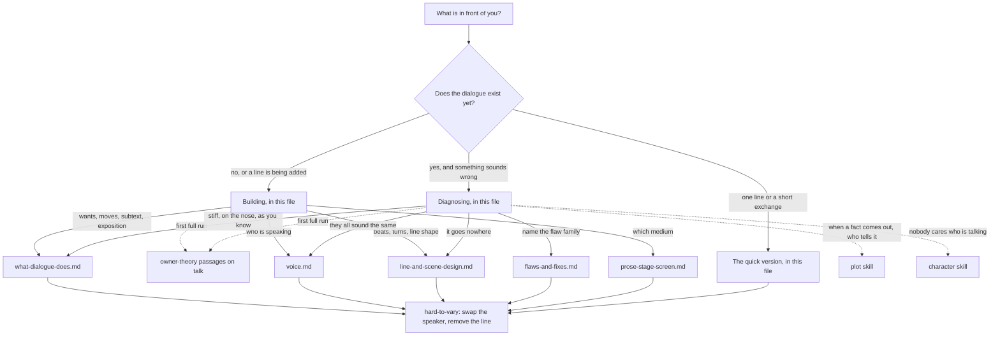

# Dialogue

This skill helps write, revise and diagnose what characters say, by one measure: what each line does. Talk is action. A line is a move one character makes on another to get what they want, and a good line does other jobs at the same time: it carries a fact the audience needs at the moment that fact changes something, it shows who is speaking, and it lets the audience sense what is not being said. A line that does no job is idle, however well it sounds.

**Built on.** No owner theory for dialogue exists yet. When the owner supplies one, it becomes this skill's primary source through the `add-source` skill, and this skill is brought into line with it. Until then the skill is built on what the four owner theories already say about talk. It derives from them and does not change them.
- **Implied World** (`sources/implied-world-theory.md`): exposition dialogue, two characters explaining to each other things they both already know, is the reserve dumped onto the surface; surplus works best mentioned in passing, taken for granted by characters who have lived with it ("The door dilated"); film's typical failure is exposition dialogue. The workshop also applies the theory's surface, implication and reserve to a speaker's inner life.
- **Bond** (`sources/bond-theory.md`): in prose, a voice is the fastest route to recognition; the Specificity lever (particular habits, voice, history) and where it breaks; the Humour lever (constant quips undercut stakes); Interiority; care can't be ordered, so characters praising a character makes audiences resist; care is social.
- **Gap** (`sources/gap-theory-of-narrative.md`): the teller, and the perspective gap, where voice lives (the slippage between what a narrator says and what we suspect); the knowledge gap, between what the audience knows and what each speaker knows; withholding.
- **Anticipation** (`sources/anticipation-theory.md`): the knowledge position, chosen scene by scene; characters' reactions cue ours.

Before a first full run in a conversation, read these passages in full, once: Implied World, Part 1 (the key terms and principles) and Part 2 sections 3 and 4 and the prose-and-film table; Bond, Part 1 (the ladder and the ten levers, with where each breaks) and, in Part 2, "The limits of care" and the books-and-film table; Gap, Part 1 (the terms, the five gaps and the seven principles) and Part 2 section 5; Anticipation, Part 2 sections 6 and 7. All four theories are short; reading them whole is better still. The modules add detail from McKee's *Dialogue* (the main book for this skill), Truby's *The Anatomy of Story* and Egri's *The Art of Dramatic Writing*, in the workshop's own words. Where a book disagrees with a theory, the skill follows the theory and records the book's view as a rival.

**Words used in one sense only.**
- **Dialogue** is any words a character says to anyone: to another character, to themselves, or out to the reader or audience (McKee's wide sense). Narration by a teller who is not a character is not dialogue, though this skill helps where the two meet. In plain phrases the skill also calls dialogue **talk** ("talk is action"), and names its kinds that way: in-scene, out-of-scene, reported and inner talk, defined in `references/what-dialogue-does.md`.
- A **line** is one character's go at speaking, however long. A **speech** is a long line.
- A **move** is what a line does to its listener to get the speaker what they want, named with an *-ing* verb: pleading, cornering, testing, flattering. The **words** are how the move is carried out. McKee calls the move the *action* under the *activity* of talking.
- A character's **want** is what they are after. Their **scene want** is what they are after in this scene; McKee's test is that granting it would end the scene.
- A **beat** is one move and the reaction it draws. A scene's **value** is what it puts at stake, named as a pair of opposites (trust and suspicion); its **charge** is where the value stands at a given beat (McKee's terms). The **turn** is the beat where the charge changes.
- A sentence's **pivot word** is the one its sense hangs on (McKee calls it the *key word*). This skill keeps **key words** for Truby's sense: words a character or story repeats until they carry meaning (`references/line-and-scene-design.md`, sections 6 and 7).
- **Subtext** is everything under the words: what the speaker thinks, feels, wants and is doing. The **text** is the words.
- A **voice** is the way of speaking that only this character has.
- **Exposition** (McKee's term) is any fact the audience must be handed, out of the reserve, to follow the story.
- The owner theories' terms keep their meanings: **surface**, **implication**, **reserve** and **surplus** (Implied World); **teller**, **withholding**, the **knowledge gap** and the **perspective gap** (Gap); the **knowledge position**, with the audience ahead of, level with or behind the characters (Anticipation); the **rungs** of care and the ten **levers** (Bond, where a capital marks the lever: Specificity, Humour, Interiority).

## The idea in one example

A family drama. Kate and Tom meet at their father's farmhouse the day after his funeral. In the draft, Kate reminds Tom that, as he knows, Dad left the farm to both of them, that she has lived in London for ten years, and that a buyer has made an offer. Tom agrees, and adds that Dad was ill for a year. Readers call it stiff.

Run it through. Every line is a fact both of them already know: the reserve dumped onto the surface, the Implied World theory's own example of showing too much. Ask what each wants from the other right now: nothing, so no line is a move. Give Kate's lines to Tom: they fit him just as well, so no voice is holding them.

Fix the scene before the words. Kate's scene want: Tom's signature on the sale today, before he can talk her out of it. She cannot say why she needs the money (the estate agency she runs is failing, and she is too proud to say so). Tom's scene want: for her to admit she did not come when Dad was dying. He cannot say he wants her to stay (he would have to admit he is lonely). Now the facts become what McKee calls *exposition as ammunition*. The joint ownership is Kate's weapon: the agent needs both names by Friday. Her ten years away is Tom's: he tells her flatly where the spare key is kept these days. Dad's illness comes out as a correction, when Tom names the ward she got wrong. Voice follows the people: Kate talks in the language of her trade (completion, chain, asking price); Tom names the fields and the machines and never explains them; taken for granted in passing, the way the Implied World theory says surplus is best delivered, they imply a family's history (implication, not surplus, since they also show which of the two stayed). What neither can say stays underneath. The audience infers her money trouble from how fast she wants it signed.

Then test with `hard-to-vary`. *Swap the speakers*: Tom's line about the key only works in the mouth of the one who stayed, so voice and history hold it. *Remove* that line: the audience loses both the fact that she has been away and his accusation, two jobs at once, so it is held. *Swap* the ward for any other small detail she gets wrong: the scene works the same. What is held is that he knows the last year and she does not, not which detail shows it. That choice is free; say so, rather than dressing it up as necessary.

## Where to look, and when

This file holds the method: building dialogue, diagnosing it, and the quick version. The modules add depth. Open one only when its row applies.

| You are... | Open | To get |
|---|---|---|
| checking one line or a short exchange | nothing else: "The quick version" below | four questions |
| about to do a first full run in this conversation | the owner-theory passages listed under "Built on", in full | what the frame says about talk |
| deciding what a line is for, or what goes unsaid | `references/what-dialogue-does.md` | talk as action, whom a line is aimed at, the jobs a line does, said, unsaid and unsayable, text and subtext, the move under the words, exposition in dialogue, reported talk |
| making characters sound like themselves, or the complaint is "they all sound the same", or working on a narrator's voice or inner talk | `references/voice.md` | what a character knows and how they see, where their words come from, what they would never say, voice under pressure, key words, narrators and inner talk, wit |
| shaping lines and exchanges inside a scene | `references/line-and-scene-design.md` | where a sentence's pivot word falls, economy, the pause and silence, wants and what opposes them, beats and turns, the kinds of conflict a conversation can carry, the layers of dialogue (story, moral, key words) |
| looking at a draft that sounds wrong | `references/flaws-and-fixes.md` | the flaw families (credibility, language, content, design): each flaw's symptom, why it fails, and the fix |
| deciding what talk can do in this medium, or adapting | `references/prose-stage-screen.md` | stage, film, television and prose; narration, voice-over, direct address and inner talk, framed by the owner theories' medium tables |
| testing whether a line does any work | `.claude/skills/hard-to-vary/SKILL.md`, and section 5 of its `references/by-domain.md` | remove, swap, flip, and what holds a choice in place |
| finding the problem is when a fact comes out, or who tells the story | `.claude/skills/plot/references/reveals-and-withholding.md`; `.claude/skills/plot/references/telling-and-perspective.md` | the schedule of knowledge; the teller and fair play |
| finding the problem is that nobody cares about the speaker | `.claude/skills/character/SKILL.md` | the ladder of care and the levers |

**Keeping the map true.** When a module is added, split or changed, update the table and the graph in the same edit. A module with no row is unreachable: give it a row or remove it.

**What belongs in this skill.** One test for any addition: does it help decide what a character says or leaves unsaid, to whom, in what words, and whether each line does a job? When a fact should reach the audience goes to `plot`; why the audience cares about the speaker to `character`; how a world's invented way of speaking works as a departure to `story-world`; what a genre's audience expects to hear to `genre`. When in doubt, leave it out and say why.

## The stance

- **Talk is action.** Judge a line by the jobs it does, not by how it sounds; for most lines the first job is a move. A line that does no job is idle, however witty.
- **The scene first, the words last.** McKee and Egri argue it from a mechanism *(built: the words are the outward form of a want meeting resistance)*, and Truby's order of work assumes it *(asserted)*: dead lines usually mean something is missing underneath (a want, a collision, a turn). Rewording a scene that fails as a whole tends to make it more on the nose, not less (McKee's *paraphrasing trap*, asserted with a plausible mechanism).
- **The surface implies.** Audiences infer a person's inner life from what they say, as they infer a world from its surface. Leave them work to do. But subtext is a choice, not a virtue: a character hides only what something makes them hide.
- **Every line pays its way, and texture is a way of paying.** Economy cuts idle words. It does not cut surplus: a detail taken for granted that makes the world feel real is doing a job, provided it passes the World job's gauge (Building, Step 7).
- **The voice is the character's, not the writer's.** Character before cleverness. And never order care: characters praising someone makes the audience resist.
- **No owner theory yet, so mark the books' rules.** Most of them are fitted, drawn from admired works: patterns to question, not laws. Say *fitted*, *built* or *asserted*, and never dress a book's rule up as the owner's.
- **No scores.** Do not count jobs per line. One line that does the one job this scene needs beats three that each do a little.

## The procedure

Read the owner-theory passages listed under "Built on" before a first full run in a conversation. There are two modes: **building**, when the dialogue does not exist yet or a line is being added, and **diagnosing**, when a draft exists and something sounds wrong.

### Building

**Step 1 - Medium, wants, obstacles, and who knows what.** First fix the medium and, in prose, the teller: who narrates, and whether the narration may state what the talk leaves unsaid. Every later step depends on it (`references/prose-stage-screen.md`, section 1). Then, for each speaker, name the scene want (check it: granting it would end the scene), the larger want behind it, and what stands in the way: the other person, the place, or a tie they cannot risk. Then write who knows what: each speaker, and the audience, which is ahead of, level with or behind them (Anticipation, principle 6). Ask whether the audience cares yet about at least one speaker; if not, that is the `character` skill's work, and no line will fix it. McKee's own question list leaves out these two checks; the owner theories add them. A speaker who wants nothing from anyone here should not be talking.

**Step 2 - The beats.** Before writing a word, lay out the scene as moves and reactions, each named with an *-ing* verb (pressing / dodging, testing / confessing). Mark the turn. Check that no beat repeats the one before it, and that pressure rises in steps, with partial releases, and breaks its pattern before the audience learns it (Anticipation, principle 7). More: `references/line-and-scene-design.md`.

**Step 3 - Said, unsaid, unsayable.** For each speaker write three private notes: what they will say, what they know and keep back, and what drives them that they could not name even to themselves. Then settle each item on the second list with two questions. (a) Would something keep it underneath: fear, shame, manners, a tie they would lose, what the listener could do to them? If so, it stays under the words. (b) If nothing would, is saying it a move that costs the speaker something with this listener, or only a report of what the audience has already inferred? Let them say it when it is a costly move; when it is a report, cut it or leave it for the audience to infer. In prose the narrator may also state it, if Step 1 allows. More: `references/what-dialogue-does.md`, sections 4, 5 and 9.

**Step 4 - Voice.** For each speaker: what they know (it shows in their naming words), how they see (their colouring words), where their words come from (work, place, class, schooling, the culture they have soaked up), what they would never say, and how this pressure changes how they speak. Set the speakers against each other so the contrast does the work. More: `references/voice.md`.

**Step 5 - Exposition as ammunition, surplus in passing.** List the facts the audience needs from this scene. Give each to a character with a reason to use it now: as a weapon, a probe, a question it opens, or an answer to someone who genuinely does not know; or, in prose, let the narrator tell it. Run the honesty test, McKee's, in the workshop's sharper form: does each speaker have a reason of their own to say this, to this listener, now, or is the line there only because the audience needs the fact? A hidden move is fine; a hidden author is not. Let world texture come in passing, taken for granted. When a fact should come out at all is plot (`.claude/skills/plot/references/reveals-and-withholding.md`). More: `references/what-dialogue-does.md`, section 7.

**Step 6 - Line design and economy.** Now write the words. Put each important sentence's pivot word where it should land; cut every word that can go without losing meaning, voice or rhythm; place a pause before and after the turn and almost nowhere else; ask of each beat whether a look, a gesture or a silence could do it. Fit each line to the medium chosen in Step 1. More: `references/line-and-scene-design.md` and `references/prose-stage-screen.md`.

**Step 7 - Read it aloud, then test.** Read the scene aloud from each speaker's side and mark where you stumble, run out of breath or feel nothing. Then run `hard-to-vary` on the lines that matter:
- **Swap the speaker.** If another character could say the line unchanged, the voice is not holding it.
- **Remove the line.** Which job stops being done: a move, a fact, the voice, the world, who knows what, a cue to the audience (`references/what-dialogue-does.md`, section 3)? If none, cut it. If removing it loses nothing, check whether another line does the same job: keep the one that also does a second job, cut the other, then run the test again on the line you kept. Count the World job only if it passes its gauge: swap the detail for a neighbouring one from another place or time; if the implied world does not change, or the audience would have assumed it anyway, the line is not doing that job.
- **Swap the move.** If pleading could become threatening and nothing else in the scene would need to change, the want is not holding the move.
- **Flip the reply.** If the listener could say yes or no equally well with nothing earlier in the scene having to change, the turn is not held in place.

### Diagnosing

**Step 1 - Pin the symptom.** Before explaining anything, say to whom (all readers, some, an actor at a read-through), where (the line, exchange or speech) and compared with what (a scene in the same draft that works, an earlier draft, a named work). Freeze that question while you test. Then read the complaint as a pointer, not a verdict:

| The complaint | What it usually means | Look first |
|---|---|---|
| "stiff", "nobody talks like that", "as you know" | credibility: a line with no reason in the speaker | the honesty test (whose reason is the line?), `references/what-dialogue-does.md` section 7; `references/flaws-and-fixes.md` |
| "on the nose", "they say exactly what they feel" | content: subtext turned into text, or a feeling reported to the audience instead of spent on the listener | `references/what-dialogue-does.md` sections 4, 5 and 9 |
| "they all sound the same", "generic" | language: lines any character could say | `references/voice.md` |
| "melodramatic", "over the top" | credibility: words bigger than the want behind them | `references/flaws-and-fixes.md` |
| "it goes round in circles", "nothing happens" | design: one move repeated; no turn, or a turn in the wrong place | `references/line-and-scene-design.md` |
| "the speech is too long" | content: nobody reacts, nothing changes | `references/flaws-and-fixes.md` |
| "too much exposition" | credibility, or a fact at the wrong time | `references/what-dialogue-does.md` section 7; then `plot` |
| "the banter isn't funny" | design or voice: the pivot word buried before the laugh, or the wit is the writer's | `references/line-and-scene-design.md`; `references/voice.md` section 9 |
| "the voice-over is dull" | medium: the telling only lists events, with no gap between it and the pictures | `references/prose-stage-screen.md` |
| "I don't care who's talking" | usually not a dialogue fault | `.claude/skills/character/SKILL.md` |

**Step 2 - Whole scene or one line? Then go down a layer.** If the trouble is one line in a scene that works, go to Step 4. If the whole scene fails, do not touch the words yet: rewording a scene that fails as a whole tends to drive it further on the nose (McKee's *paraphrasing trap*, asserted with a plausible mechanism). Work down the repair order in `references/flaws-and-fixes.md`, section 7. Its first layer, want and wall, is four questions in order, the workshop's form of McKee's causes of a scene whose words and wants have come apart: does each speaker want something here; is each move aimed at that want; is the heat of the words matched to the size of the want, no bigger and no smaller; and do the wants collide? The first "no" names the repair. If the fault sits above the scene (no one cares about the speaker, or the fact arrives at the wrong time), hand off at Step 6.

**Step 3 - Label the beats.** Write an *-ing* pair beside each beat. Two neighbouring beats with the same label, or the same pair swapped round, are one beat said twice. Find the turn: too early, too late, or missing.

**Step 4 - Name the flaw family.** Credibility, language, content or design (McKee's four families, used as the workshop's sorting). The symptom, the reason it fails and the fix for each flaw are in `references/flaws-and-fixes.md`.

**Step 5 - Fix the smallest thing, and test it.** Name the one want, move, line or word to change. Test the fix with `hard-to-vary` on the line that forced it and on the lines it must leave alone. Check it does not knock out another job: cutting a fact a later turn needs, or stripping the wit that was carrying care.

**Step 6 - Hand off where the question crosses over.** When a fact should come out, and who is fair to hold it back: `plot` (`.claude/skills/plot/references/reveals-and-withholding.md`, `.claude/skills/plot/references/telling-and-perspective.md`). Whether the audience cares about the speaker, or a line is "out of character": `character`. A world's invented way of speaking, as a departure that costs attention: `story-world`. What a genre's audience expects to hear: `genre`. For a critique of a whole work, `story-critique` leads if it is available, and this skill is consulted on the dialogue.

## The quick version

For one line or a short exchange, four questions are enough.

1. What does this speaker want from this listener right now, and what is the line doing to get it? Name the move with an *-ing* verb.
2. Give the line to another character. Does it still fit? If yes, the voice is not holding it.
3. Remove the line. Which job stops being done: move, fact, voice, world, who knows what, cue? If none, cut it; if another line does the same job, keep whichever also does a second.
4. Would fear, shame, manners or a tie keep this underneath? If not, is saying it a move that costs the speaker something with this listener, or a report of what the audience already knows? Let them say it only when it is a costly move.

## Traps

- **Polishing words to fix a story problem.** If no one wants anything, no wording will save the scene. Go down a layer first.
- **Subtext everywhere.** A character who talks round something for no reason in them is the writer being coy. Hide only what something makes them hide.
- **Transcribing how people really talk.** Real conversation circles and pads; dialogue gives the impression of it while every line works.
- **Making every line brilliant.** Wit that is the writer's, not the character's, breaks belief, and constant quips undercut stakes.
- **Cutting all texture as small talk.** A line of chat that takes the world for granted may be surplus doing its job. Cut the chat that does nothing, not the chat that shows how things are here.
- **The newcomer who asks conveniently.** An outsider fixes an exposition dump only if they have their own want and reason to ask.
- **Ordering care through talk.** Characters praising someone's brilliance or kindness makes the audience resist. Show the moves that earn it.
- **Tics for a voice.** Catchphrases and verbal quirks that reveal nothing are Specificity breaking, not voice.
- **Reading subtext as fact.** A book's confident reading of what a character "really" wants is one inference. The work may mean it to stay open.
- **Treating a book's rule as a law.** "Never state a feeling", "every line must do three jobs", "every beat must top the last": patterns drawn from admired works, each with its exceptions.
- **Diagnosing before pinning the symptom.** "Stiff" for whom, in which line, compared with what? An unpinned complaint invites a loose explanation.
