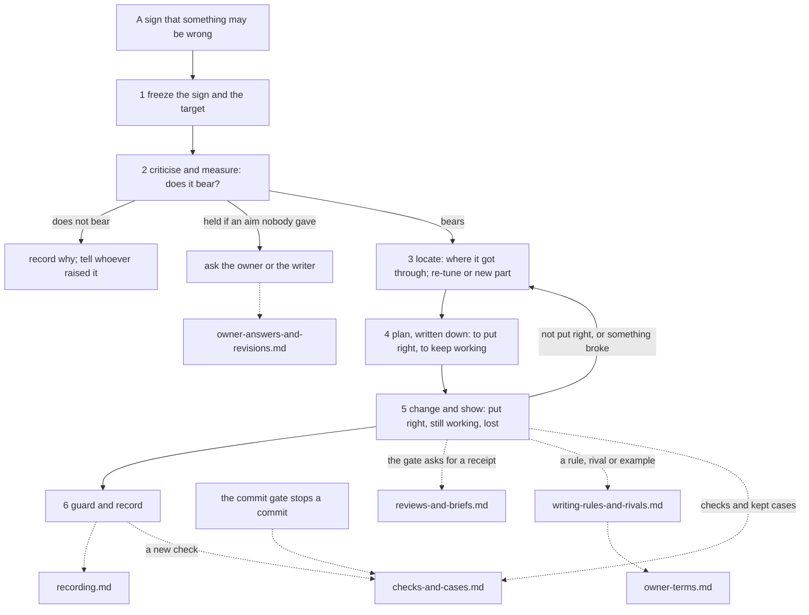

# Error correction

Anything in this workshop can be wrong: a skill's rule, a check, a record, a brief to another agent, a note to a writer, this skill. Error correction is how the work goes on anyway. Errors are looked for, each one found is removed, and each removal leaves the workshop less likely to make that kind of error again.

**Error correction is the process. Hard to vary is the metric.** The metric is what the process uses wherever it judges an explanation: whether a criticism holds, where a fault lies, why a change works, whether a new rule earns its place, and whether a claim is ready for the owner. It is reported as a mark (held, held if, two routes, loose, idle, unknown), never as a count or a score. Where exactly the metric applies is the workshop's reading of the owner's instruction "Hard to vary is a metric. Error correction is a process."

**Built on.** The owner's foundation, `foundations/claude-fable-semantics.md` (frozen).
- The loop contains a critical episode (Part X) and a repair (Part XI). Guarding against a return and recording are the workshop's own additions.
- A criticism has four parts: target, defect, grounds and connection. Whether it bears is its verdict (Part IX, K1).
- A failed test shows only that the thing tested, what surrounds it and its inputs cannot all be right (Part IX, K3).
- A change must put right what it set out to fix and keep what it was to protect, and what it lost must be shown (Part XI).
- Claims need receipts (Part IX).
- A missing input stays missing (Part XIV).
- Any part of the practice, this one included, can be criticised, and the result must be able to change how work proceeds (Parts I and XIII).

The metric is the `hard-to-vary` skill, which puts Parts V and VI to work. Its own rule keeps project process out of it, so the process lives here.

## The idea in one example

The critique of *The Catch* (`26 Test - The Catch - two versions.md`) said nobody knew which draft came first. Yet its main table was headed "B cuts set-ups whose payoffs it keeps", which assumes B came second.

1. **Freeze.** The sign was the owner's question: "Is the hard to vary method for testing added? Or was it forgotten?" The target was the critique as committed.
2. **Criticise and measure.** Defect: the table's wording assumes B came second, though the file says the order is unknown. Grounds: the flip test. If B were the earlier draft, the same evidence would read "A adds set-ups", a different verdict. Connection: the wording rests on an order the file itself calls unknown. Verdict: the criticism bears.
3. **Locate.** Where did it get through? Hard to vary was never run on the critique's own notes (file 26, "Checks run on these notes"). The first response was a re-tune, one new line: "test your own notes". The owner answered "No no. Wrong task", and supplied the diagnosis: the fault was in the workshop, and the fix had to be built into the repository. The workshop then built the parts.
4. **Plan.** To put right: replies and write-ups reaching the owner untested. To keep working: what the craft skills already did well (the kept cases), and every check. (This plan was written down only afterwards, in C1: the rule to write it first came with the build.)
5. **Change and show.** The changes were:
   - this skill;
   - the commit gate with its review receipts;
   - the reply check in every craft skill;
   - a dated correction note in file 26.

   A reviewer then found five more phrases in file 26 that still assumed the order: the first search had stopped at the three that had been noticed. They were changed too.
6. **Guard and record.** A write-up now fails the records check unless it lists the checks run on its notes. The correction is C1 in the corrections file.

## Where to look, and when

| You are... | Open | To get |
|---|---|---|
| dealing with anything that may be wrong, or about to call something fixed or done | "The loop" below | the six steps, and where the metric is used |
| unsure how much of it a case needs | "How much to do" below | which steps each kind of change runs, and the tripwires for a full correction |
| stopped by the commit gate | `references/checks-and-cases.md`, section 2 | what the stop means and what to do |
| writing a correction, a log entry, or a note on an old record | `references/recording.md` | the record, receipts, notes on old records, closing |
| asked by the gate for a review receipt; running or answering a review; sending a brief | `references/reviews-and-briefs.md` | the reviewer agents, the receipt, a review round, checking a brief |
| writing or changing a rule, a rival or a worked example in a skill, or a new module | `references/writing-rules-and-rivals.md` | the rule card and the rival form: the metric where the workshop makes its claims |
| checking whether a passage uses an owner term in its right sense | `references/owner-terms.md` | the terms that kept drifting, each with the theory's words and a telling test |
| writing or changing a check, or running the kept cases | `references/checks-and-cases.md` | checks that can fail, planted faults, the kept cases |
| an owner question is answered, a theory is revised, a check or brief is found broken, or a frozen text seems wrong | `references/owner-answers-and-revisions.md` | what loses its licence, how to find it, recheck and record |

**Keeping the map true.** When a module is added, split or removed, update the table and the graph in the same edit.

**What belongs in this skill.** One test for any addition: does it help the workshop find, remove or stop repeating its own errors? How to judge an explanation belongs in `hard-to-vary`; how to diagnose a story belongs in the craft skills.

## Words

One word for one thing. The foundation's term is in brackets.

- **Error.** Something in the workshop that is wrong for what it is for: a rule that contradicts an owner theory, a check that passes a fault, a record that says what did not happen, a note that would mislead a writer. An error in the part the advice rests on is what counts most. An error beside it does not void the rest (Part I).
- **Sign.** Anything that suggests an error: a failed check, a reviewer's finding, a stalled trial, an objection, your own doubt. A sign is not yet a criticism (hard-to-vary's word).
- **Criticism.** A sign worked into four parts:
  - the **target**: the exact thing, as it stood;
  - the **defect**: what is wrong with it;
  - the **grounds**: a theory line, a case, a check's output;
  - the **connection**: how the grounds show the defect in the target.

  A criticism is itself a guess (Part IX).
- **Bears.** The verdict on a criticism. It follows the mark hard-to-vary gives the criticism's working part, the part that carries the point. How the marks give the verdicts is the workshop's mapping, not the foundation's:
  - *held* gives **bears**; so does *two routes* (the point holds by either), and both routes are named;
  - *unknown*, or *held if* a part that is itself unknown, gives **does not bear yet**: name the test or the question that would settle it; you may act on it as a labelled guess;
  - *loose* or *idle* gives **does not bear**;
  - *held if* an aim or value that only the owner or a writer can give gives **held if**: give it both ways, and ask whoever holds that aim.

  "Does not bear yet" is the workshop's use of hard-to-vary's "not settled" for a criticism. The foundation's own word is bearing (Part IX, K1), which holds or fails; a criticism whose bearing cannot yet be settled is one it leaves open.
- **Correction.** One run of the loop, from sign to record. Closing one is a decision, not a proof (Part X).
- **Change.** What is made to answer a criticism, in this skill's words. The craft skills say "fix" for a change to a story. hard-to-vary uses "fixed" for a requirement not up for test, so this skill avoids that word.
- **Put right, still working, lost.** What a change must show:
  - *put right*: what it set out to fix now holds;
  - *still working*: everything it was to keep working still works, on the stated cases;
  - *lost*: anything else it gave up, listed.

  It must also show its **route**: what ran, and in what order, from the change to the case or check that now passes (Part XI, repair; Part IX, an active route, read from what happened).
- **Re-tune; build a new part.** The workshop's reading of Derivation 10. To re-tune is to vary what exists: reword a rule, add a warning. To build a new part is to add a piece every earlier version lacked: a check, a mode, a step, a rule in one home. In the foundation's own terms both are built, since both are made with the target in view (Part IV). The line drawn here is Derivation 10's line between a fault in the structure and a fault in the settings. These are hard-to-vary's words.
- **The thing, the rig, the inputs.** The three layers of any test, in hard-to-vary's words:
  - *the thing*: what is tested;
  - *the rig*: what is set up around it (a brief, a template, a check, this procedure);
  - *the inputs*: what went in, as prepared (a case, a reading of a draft).

  A failed test shows only that the three cannot all be right. Which one to change is a new guess (Part IX, K3).
- **Receipt.** A pointer to events, each with what it is taken to show: the command, what it printed, and what that means; a commit; a file and line; a reviewer's report. A record made from the claim, rather than from the event, is not a receipt for the claim, whenever it was written. A later copy of an event is the same witness, not a second one (Part IX, receipts; Part IV). A **review receipt** is the kept record of one review, in `.claude/reviews/`, with the reviewer's findings pasted in.
- **Licence.** Leave to rely on a passage, within its scope: the question it was made for. When a premise it rests on is withdrawn (an owner answer, a revised theory, a check found broken), the passage loses its licence until it is rechecked. It does not become false (Part IX, K2).
- **Kept case.** A short story problem in `kept-cases/`, with what a good answer must and must not do, written before any run. The kept cases are the stated occasions on which "still working" is checked.
- **The corrections file.** `27 Corrections.md`: the kinds of error seen here, and every full correction, open and closed. (*The register* means the source register in `sources/README.md`.)
- **Hook; staged; the commit gate.** A hook is a small program that Claude Code or git runs by itself at a set moment. Staged means marked with `git add` to go into the next commit. The commit gate is the hook git runs before every commit and every merge commit (`.githooks/pre-commit`, `.githooks/pre-merge-commit`). It stamps each commit it passes, and runs the checks as they were in the last commit it approved (found by walking back along the main line; a merge made on GitHub with no conflict counts as approved, with the exceptions in references/checks-and-cases.md, section 2), comparing the files with that commit, so a check cannot be loosened in the same commit as the work it would stop, and what a commit made without the gate got wrong in the files stops the next commit until it is put right (apart from a check it loosened, which is judged only by the planted-fault test and its late review). `--no-verify` is a switch that would make git skip the gate; a Claude hook refuses it and the other usual ways round the gate. The gate stops most honest mistakes and shortcuts, not all: those it is known not to stop are listed in references/checks-and-cases.md, section 2, "What the gate cannot do".

## The stance

- **Look for errors; do not wait for them.** The history shows where they came from: fixes that made new errors, one brief that carried a mistake into many files, and misses that only the owner caught.
- **Nobody grades their own work.** A change to what the workshop says is reviewed by an agent that did not make it, and the commit gate will not take the change without that review's receipt. A test you built, on cases you chose, for work you did, shows that the work runs, not that it works.
- **Change the stage, not only the instance.** Every error got past some stage. Change that stage as well as the file.
- **What the owner values is an input.** The workshop never ranks or overrules it. Facts the owner states, and whether two of the owner's wants can both be met, stay open to question. A conflict goes back to the owner as a question. An owner objection is never set aside: if it seems not to bear, ask the question that would settle it.
- **A failing check is a sign, never an obstacle.** Correct what it found, or correct the check in its own commit. Never get round it.
- **Keep the record whole.** Old log entries are never rewritten. A write-up is changed only under a dated note that lists each change. A correction is added, and points to what it corrects.
- **This process is open to the same treatment.** A step, rule or check that would catch nothing is weight. That means its planted fault passes, or removing it, alone and together with its neighbours, loses no job. Weight is why the full hard-to-vary procedure went unused before (log entries 20 and 22). Remove what is idle, through a correction like any other.

## The loop

**1. Freeze the sign and the target.** Write the sign down as it came. Quote the owner's own words. Pin the target as it stands: the file, the lines, and the commit (`git log -1 --format=%h -- <file>`). Say if it has uncommitted changes. Change nothing yet. The target has to be on record, as it was, before its criticism. Otherwise nobody can tell afterwards what was wrong.

**2. Criticise, and measure the criticism.** Write the target, defect, grounds and connection. Then measure the criticism's account of the defect with the metric's quick version:
- *Flip.* Would you be as sure of the opposite?
- *Swap.* Would the same criticism fit any file, or any story? If so, it is a stock note.
- *Rival.* What else explains the sign? The check is wrong; the case was misread; the reading of the theory is wrong; nothing is wrong.

Mark the working part and give the verdict (see **Bears** in Words). If it does not bear, record why and tell whoever raised it. A criticism of a rule, rival or check also gets the rule card, the rival form or a planted fault (`references/writing-rules-and-rivals.md`, `references/checks-and-cases.md`). The full hard-to-vary procedure is for when the whole explanation behind a rule is in dispute.

**3. Locate: where did it get through, and what changes?** Write each place the fault could be as a rival guess:
- the thing (a rule, module, check or record);
- the rig (the brief, template or procedure that produced it or let it through);
- the inputs (the case or draft, and how it was read).

For each guess, name the case that would come out differently if the fault were there, and run that case. Name the stage that should have caught it. Look the kind up in the corrections file.

If the kind came back after a re-tune, ask two questions: what does every re-tuned version lack, and did the re-tune ever reach whoever makes the error? Build a new part only when you can name what was missing. That this is a tripwire, not a proof, is the workshop's reading of Derivation 10.

Record the new part's witness:
- what it is, and what it ties together;
- who made it, and in which commit;
- what it was made from (the criticism, a research report, a brief, another file's text);
- which decisive step came from outside the workshop (the owner's diagnosis, question or instruction).

A change that adds a part with no other job is a patch: say so. Run it on the case that forced it and on the cases it must leave alone, as hard-to-vary says of any patch. If a further job is claimed for it, say which rival that job rules out.

**4. Plan, written down before changing anything.** For a full correction, write it in the correction's record before changing anything. For a smaller change, the list below is the plan, fixed by this step before any result is known: in the review receipt's "Change" line, say what was on it, and name anything you added to it and when.
- **To put right:** the failure, and the case or check output that shows it.
- **To keep working:**
  - the checks;
  - the kept cases for every skill the change touches;
  - every other statement of the same rule (search all the skills for it);
  - every earlier correction of this passage. Find those with `git log -L` on its lines, and by searching the corrections file and `.claude/reviews/`.
- **Inputs:** any owner decision the verdict depends on, and whether it has been given.

**5. Change, and show what it did.** Put a shared rule in one home and point to it from elsewhere; copies drift apart. Say whether the change re-tunes or builds a new part. A new or changed rule, rival or example gets the card in `references/writing-rules-and-rivals.md`. Then show:
- **Put right:** rerun what showed the failure. Also run a case where the nearest rival change (the one-line patch, or doing nothing) would come out differently. A change confirmed only on the case it was made from has shown nothing new.
- **Still working:** rerun everything on the plan's list, and run the change on its target and on its nearest innocent neighbour. Anything on the list that now fails is broken, not lost: go back to step 3.
- **Lost:** list everything else that changed or was given up. Whether a loss is acceptable is the owner's call: recommend, do not decide.
- **The route:** say what ran, and in what order, from the change to what now passes. Then remove the change, alone and together with any other change made for the same failure. If the failure comes back only when both are removed, they are two routes, and both are credited. Record which of three things happened:
  - put right through the reason: the change was made by using the reason, and the route shows it;
  - put right without a reason that holds yet: open a second correction on the reason;
  - a reason that holds, with nothing put right yet.

  A change together with a correct reason that did not produce it is recorded as the second and third together.
- **Reviewed:** the commit gate asks for a review receipt, naming a reviewer other than the maker (`references/reviews-and-briefs.md`).

If it is not put right, or something broke, go back to step 3.

**6. Guard, and record.** Say what will catch this kind next time, in the cheapest form that fires by itself:
- a check with its planted fault;
- a kept case;
- a step in a skill;
- a rule in `CLAUDE.md`, with its reason.

Measure any addition before making it. Name the error it catches. If something already catches that error, say what each one guards against that the other does not, or merge them. An addition that names no error is not made. Then record the correction (`references/recording.md`) and say what would reopen it.

**Before any claim reaches the owner or a writer.** This covers a reply, report, log entry, commit message or write-up:
- Every "checked", "put right", "works" or "passed" has a receipt.
- "Not found" says where you looked. A cut-off output proves nothing.
- A verdict that needs an aim nobody gave is held if that aim, given both ways. A verdict that needs a fact nobody has told you, such as which draft came first, does not bear yet: ask, and if the note must go now, give it both ways.
- Words that assume an order match what is known. "Cuts", "adds", "restores", "replaces", "new", "later", "no longer", "becomes" and "loses" are only examples: no list catches them all. Read every sentence that compares two versions, one by one, not only the ones a search finds.
- Checks that read the same thing through the same frame count as one.
- Say what was not checked.
- Each "because" survives the flip and the swap. (A hook repeats this list after every commit.)

## How much to do

Weight follows what the change touches and the cost of being wrong, not the size of the slip. These thresholds are the workshop's recommendation, and the owner can reset them.

| The change | Steps it runs | Recorded in |
|---|---|---|
| **No meaning changes** (a typo, a link, a map row, formatting) | Make it and stage it; let the gate check it. No kept-case rerun: before committing, add a line to `kept-cases/runs.md` saying so, with the line `check_records.py --fingerprints <skill>` prints (it updates only that skill). If the skill's cases were already owed a rerun, it refuses: write the runs.md line without a fingerprint line, and the skill stays listed. The error-correction and add-source skills have no kept cases and need no line. Not in the hard-to-vary skill, which is the owner's: ask first (S11). Never for a check, hook, list or the settings, which always get a full review | A light review receipt: the maker, "Reviewed by: none", why no review was needed, and the "Book text" line if the books are absent and the module draws on a book. One line in the next log entry |
| **A meaning changes in one place** (a review finding, your own reading) | Step 2's quick version; step 4's search for other statements of the same passage and for earlier corrections of it; a reviewer; the kept cases for that skill rerun before the work is called done, or the log says they were not | One line per finding in the review receipt: the target, what was wrong, applied or rejected, and why. A review round is one correction, however many findings |
| **A new or changed rule, rival or check** | As above, plus the rule card, the rival form, or a planted fault | The same, with the card's marks in the receipt |
| **A check, a hook, the settings or the allowed-titles list is changed** | As for a new rule, in a commit of its own (the gate refuses it mixed with other work); the last approved commit's planted-fault test must still pass on it. (The frozen list is different: a new theory's fingerprint line comes in the same commit as the theory, as add-source says, with a full review.) | A full review receipt; a test that no longer fits is named under "Tests retired", with why. Any test but those of the maps and the owner quotes is retired only with the owner named first under "Reviewed by", told in plain words which guard would be lost |
| **A tripwire fires** | The whole loop | The corrections file: the five parts and a status line (`references/recording.md`) |

**The tripwires** fire when an error got past the stage meant to catch it:
- a check, a record, or a skill's statement of what a theory says turns out to be wrong after it was committed, or a brief turns out to be wrong after it was sent;
- the owner caught it;
- it had already reached the owner;
- a kept case failed on committed skills;
- a kind of error got past the catch that the corrections file names for it.

These are not tripwires:
- **Anything the gate stops before a commit.** That is the gate doing its job: correct what it found. The one exception is a stop that finds what a commit made without the gate got wrong in the files (a frozen theory edited, an old log entry rewritten, a receipt deleted, a check loosened): that error is already in the history, past the stages meant to catch it (references/checks-and-cases.md, section 2). A stop that only asks for a late receipt is not one.
- **A writer's objection to a note.** It is answered in the reply, as the reply check says. It becomes a correction only if the fault is traced to a skill's own text. When the writer is the owner, it is also an owner objection: never set it aside, and if it seems not to bear, ask the question that would settle it; if it bears and the note came from a skill's own text, the tripwire "the owner caught it" fires.

## Where the process runs

Built in means it runs where the workshop works, not that it is written down somewhere. The boundary is this repository's files, the programs that Claude Code and git run from them, and agents while they work here. A result holds for the commit it was made on. Each mechanism below either runs by itself, or depends on an agent following it and leaves a trace that someone can read.

| Place | What happens there | How it is enforced |
|---|---|---|
| Every commit, and every merge commit | The last approved commit's checks run on exactly what is staged, comparing it with that commit; a passed commit is stamped. A change to a check must come in a commit of its own, and must still pass the last approved commit's planted-fault test | By itself, within one commit: `.githooks/`, switched on by the session-start hook, in a copy where it is on. A Claude hook refuses the usual ways of skipping it (the usual spellings only). Across two commits, a loosened check rests on its review (on trust) and the planted faults |
| Commits the gate did not approve (a skipped gate, a revert, cherry-pick or rebase that went through without a conflict and changed the contents, a squash whose stamp no longer matches, a merge made on GitHub with a conflict, a commit made on GitHub) | What they got wrong in the files stops the next commit through the gate, and clears once put right; a check they loosened is judged only by the planted-fault test and its late review. The recheck asks each for its review receipt (a rebase that leaves the change and its neighbouring lines as they were keeps it) and believes a withdrawal only if the files show it. Book files and changes to the gate's own files are noted, only until the next approved commit: after a pull, rebase or merge made mid-session, run the recheck before the next commit, copy each note into the log entry of the commit about to be made (or the next one, if a note is first seen in a passed commit's output) and tell the owner. Settled once a later commit is approved | By itself, but after the fact: the gate, and `recheck_commits.py` at session start and before each commit; acting on a note is on trust, with the log entry as the trace. What this does not stop: references/checks-and-cases.md, section 2, "What the gate cannot do" |
| A change to what the workshop says | Reviewed by an agent that did not make it | On trust, with a trace: the gate refuses the change without a review receipt that names a reviewer other than the maker and carries the reviewer's report. It cannot tell whether that reviewer really ran |
| An edit to a frozen file | Refused before it happens; the fingerprint check catches any other route | By itself: `.claude/hooks/protect_frozen_files.py`, and the gate |
| After a commit | The claim check above is put in front of the agent | By itself: `.claude/hooks/after_commit.py` (a reminder only) |
| Session start | The gate is switched on, and said to be on only if its files match the last commit's. The commits since the last approved one are counted and rechecked. Open corrections, open questions, stale kept cases, retired planted tests, and the first lines of any failing check (the last approved commit's checks, compared with it) are shown, and "could not run" when the checks themselves broke | By itself: `.claude/hooks/session_start.py` |
| Changing a skill's rule, rival or example | The rule card and the rival form; review by theory-checker or use-tester | On trust, with a trace: the review receipt |
| A brief to other agents | Checked by theory-checker before it goes out | On trust; a trace only when the brief is kept |
| A craft skill's reply | The reply check, with its result shown in the reply | On trust, with a trace: the reply itself |
| A test or critique write-up for the owner (a top-level file named "NN Test ..." or "NN Critique ...") | A section "Checks run on these notes" | By itself: the records check fails without it |
| The project story's status lines | Each carries "(as of entry N)"; a new entry forces a new stamp on each | On trust, with a trace: the stamp forces a second look, but not what the look finds |
| A tripwire fires | The full correction, in the corrections file | On trust, with a trace: the records check reads the corrections file |
| An owner answer, or a revised theory | Passages resting on it lose their licence until rechecked | By itself for tagged passages, once the question's status is changed; on trust for untagged readings |
| After a skill changes | Its kept cases are rerun | On trust, with a trace: session start and the records check say which skills changed since their cases last ran |

## Traps

- **Acting on a sign before it is a criticism.** "Feels heavy" and "wrong task" are signs. Work out what they bear on first. A misread sign gets the wrong thing well corrected.
- **Correcting the instance, not the stage.** The file is corrected, and the brief or template that produced it goes on producing it.
- **Changing a rule in one place.** Its copies keep the old version, and the skills now disagree.
- **Stopping the search at what you noticed.** The first correction of file 26 changed the three phrases it had seen and missed five more. Search the whole text for every form of the error.
- **Re-tuning when a part is missing.** The same kind comes back after a warning because the warning never reached whoever makes the error, or no wording could.
- **Confirming a change on the case that made it.** Run a case where a rival change would differ.
- **Crediting a change without its route.** Say what ran, and remove it in groups. A change is not shown to have done nothing until it has been removed together with its neighbours.
- **Counting.** "31 of 38 resolved" says nothing about which ones matter or why. Report what was put right, what was not, and what that means.
- **Rewriting the record.** An old entry edited to match what is known now destroys the evidence of what was known then.
- **Reading a cut-off or empty result as an answer.** "Not found" describes the search.
- **Choosing the missing input.** When the owner's aim or a draft's order is unknown, the verdict waits on it, whichever way you would like it to go.
- **Getting round a failing check.** A wrong check is corrected like anything else, in its own commit, with its planted-fault test.
- **Adding process for its own sake.** Every step, rule and check here names the error it catches.
