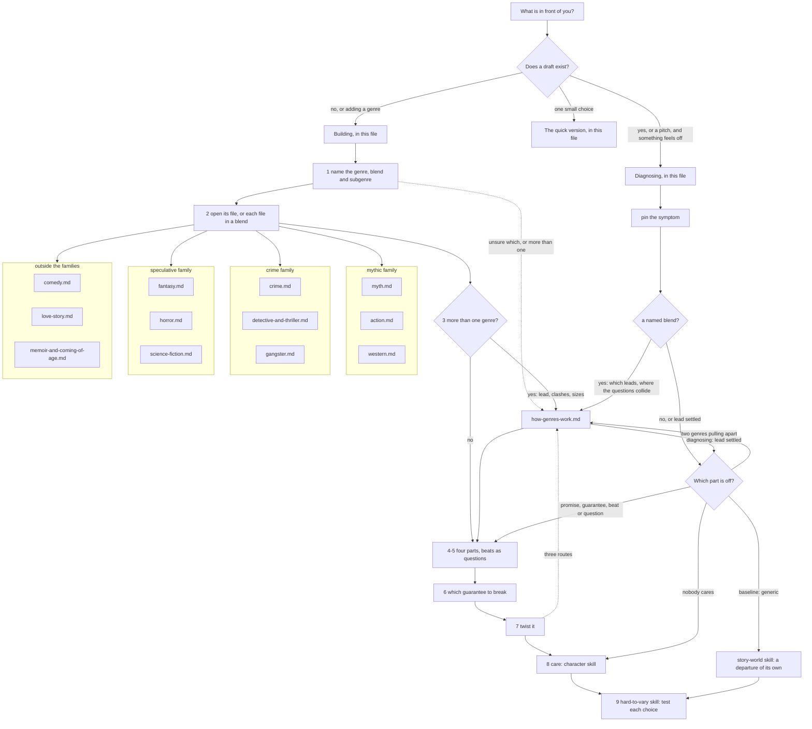

# Genre

Before a story starts, its audience already expects a kind of story: what the world will be like, what it will get, what it can stop worrying about, and what the story will ask. This skill makes those expectations visible, checks a draft against them one job at a time, and decides which to meet, which to move and which, if any, to break. It is for choosing a genre, writing inside one, mixing several, twisting one, and diagnosing a story that "doesn't feel like" its genre or feels generic. It holds one profile for each of twelve genres.

**Built on.** No owner theory for genre exists yet. When the owner supplies one, it becomes this skill's primary source through the `add-source` skill, and this skill is brought into line with it. Until then the skill is built on what the four owner theories already say about genre. It derives from them and does not change them.
- **Implied World** (`sources/implied-world-theory.md`): the baseline is the real world plus the habits of the genre; say "space station" and the audience furnishes it from earlier examples; a world riding on its genre's defaults feels generic because it is (the Fantasy that is medieval Europe with dragons).
- **Gap** (`sources/gap-theory-of-narrative.md`): every open question is a promise, a *mystery* the story promises to answer or a *wonder* it promises to leave open, and breaking either feels like betrayal; the world decides what counts as an event.
- **Anticipation** (`sources/anticipation-theory.md`): genres carry unspoken guarantees (the star survives, the child is safe); break one early and every threat becomes real; break one convincingly, not all. Care is the first term of the suspense equation.
- **Bond** (`sources/bond-theory.md`): which of the ten levers carry a genre's hero, which it lets run low, and the rule that turning one down means turning another up.

Before a first full run in a conversation, read these passages in full, once: Implied World, Part 2 sections 1 and 2; Gap, principles 2, 5 and 7 and Part 2 sections 4 and 6; Anticipation, principles 1, 5 and 6 and Part 2 sections 1, 5 and 6; Bond, the ten levers and principle 4. For Horror or Fantasy, add Anticipation principles 3 and 8 (Part 2 sections 3 and 8) and Implied World Part 2 section 3. A small case is one scene, one character, one choice or one named symptom. For a small case, or when another skill hands you one question, read only the theory passages cited in the sections you use. The modules add detail from Truby's *The Anatomy of Genres* (the main book for this skill) and a few points from his *The Anatomy of Story*, in the workshop's own words. Where a book disagrees with a theory, the skill follows the theory and records the book's view as a rival.

**Words used in one sense only.** From the Implied World, Gap and Anticipation theories, with Truby for the fourth part, the workshop defines a **genre** as a shared baseline, a set of promises, a set of guarantees and a characteristic question about how to live, which the audience brings before the story starts.
- The **baseline** is the Implied World theory's: what the audience assumes by default, the real world plus the habits of the genre. The genre's share of it is its **defaults**. A **departure** is any way the story's world differs from the baseline.
- A **promise** is something the genre undertakes to deliver: the moments its audience comes for, and an answer to its **expected mystery**, the open question the genre leads the audience to expect the story to press (*who did it?*, *will they end up together?*). Once the story presses it, it is a *mystery* (Gap principle 5), and the story must settle it. Breaking a promise reads as betrayal. (In the Gap theory the promise covers open questions, and emphasis inside the story sets it; the workshop stretches the word to the moments a genre owes, because dropping one reads the same way.)
- A **guarantee** is a protection the audience assumes the genre gives, so part of it relaxes (the star survives, the child is safe). Broken early, it leaves the audience unsafe, not cheated (Anticipation principle 5); broken at the end, it leaves grief instead (the workshop's extension).
- The genre's **question** is its outlook on how to live (Truby's *Mind-Action story view* and *thematic recipe*), kept here as a question the story answers by how it settles, never as a lesson. It is not the expected mystery: in Detective the expected mystery is *who did it?*, and the genre's question is *how is the truth found, and who carries the blame?*
- A **beat** is one of the recurring events a genre is known for, named by the job it does (Truby's genre beats, not the small beat inside a scene). A **trope** is a recognisable genre element that does no structural job.
- To **twist** a beat is to keep its job and change its order, its form, who carries it out or how it comes out.
- In a blend, the **lead genre** is the one whose question the ending settles; the others are **guest** genres.
- A genre's name takes a capital (Horror, Science Fiction, Love Story), because horror and suspense are also rungs of the Anticipation theory's fear ladder, written *the horror rung* and *the suspense rung*.

## The idea in one example

*Knives Out*. Before the first scene the audience brings a Detective story with it. The **baseline**: a rich old man dead in his big house, a family of suspects who each gain by it, an investigator with a gift and, for the practised viewer, the rule that the obvious suspect is never the one. The **promise**: the expected mystery, *who did it?*, will be pressed and answered, and the answer will surprise yet make sense looking back. The **guarantee**: the investigator is safe (in a Thriller he would not be). The **question**: how is the truth found, and who carries the blame?

Early on, the film does what the baseline says a whodunit never does. It shows the audience that the old man's nurse seems to have caused his death by an innocent mix-up of his medicines, and that she is hiding it. The beat that ought to close the story seems spent at the start. But its job, keeping the audience at work on a puzzle, is still being done, another way. The open question has moved from the past to the future: will the investigator find her out? Curiosity has become suspense (Gap principle 4: the schedule changed, not the story). Because the audience knows more than the investigator and cares about the nurse, it fears *for* her in every scene with him (Anticipation principle 6). The last act then keeps the promise in full: a different killer, found through clues that were fair all along, and he is the suspect a practised viewer had crossed off for being too obvious. A default of the genre is turned against the audience that knows it best.

Test the choices with `hard-to-vary`. *Remove* the early showing: the film becomes a standard whodunit; the promise is still kept, and the middle loses the suspense of watching the nurse nearly caught. *Swap* the nurse for a suspect the audience thinks guilty: the scenes with the investigator become a hunt the audience wants to succeed, which is Crime's shape (a known criminal pursued), not Detective's. What holds the choice in place is that the one shown is someone the audience believes innocent and fears for. *Flip* the last clue so that the answer rests on a fact the audience was never given: every earlier scene would read as a cheat. A reveal moved is a twist; a promise dropped is a betrayal.

That is the skill in small: name what the audience brings, keep the promises, choose which expectation to move and what job it still does, and test the choice.

## Where to look, and when

This file holds the method. The modules hold detail; open one only when its row applies. Every genre file has the same thirteen sections, so "section 4" means the same thing in each. When a small case matches a specific row, open that row's module; the quick version is for a small case no row names.

| You are... | Open | To get |
|---|---|---|
| choosing a genre, or writing inside one from the start | "The procedure" below, building | the order of decisions, from naming the genre to testing each choice |
| looking at a draft that doesn't feel like its genre, feels generic, or breaks faith with its readers | "The procedure" below, diagnosing | symptom first, then which part of the genre is off |
| checking one genre choice | "The quick version" below | four questions |
| unsure what a genre is here, how a promise differs from a guarantee, which genre a draft really is, how to mix two, which leads, or how to rise above one | `references/how-genres-work.md` | the general model, all twelve genres at a glance, families and sorting questions, mixing, the three routes above a genre |
| working in Horror, or borrowing it for a scene | `references/genres/horror.md` | the monster and its rules, the house that traps, the fear ladder in a Horror plot, the flip |
| working in Action | `references/genres/action.md` | the fighter who stands, the plan that breaks, guarantees that protect the team, what winning costs |
| working in Myth | `references/genres/myth.md` | the long journey that strips a self, destiny, the return home reborn |
| working in Memoir or Coming-of-Age | `references/genres/memoir-and-coming-of-age.md` | the examined life and the making of a self, truth as the teller's promise |
| working in Science Fiction | `references/genres/science-fiction.md` | the hinge technology a society leans on, society as a system, the traffic jam, the choice that decides a future |
| working in Crime | `references/genres/crime.md` | a known wrong, pursuer against criminal, a code on each side, payment that fits |
| working in Comedy | `references/genres/comedy.md` | the front and the drop, trouble the hero makes worse, safety from lasting harm, the union at the end |
| working in the Western | `references/genres/western.md` | the frontier, the protector who cannot stay, the showdown, the anti-Western |
| working in Gangster | `references/genres/gangster.md` | the rise and fall, the family man who kills, business and politics run the same way |
| working in Fantasy | `references/genres/fantasy.md` | the crossing, magic with rules, the moment the other world works perfectly, home seen anew |
| working in Detective or Thriller | `references/genres/detective-and-thriller.md` | the hidden killer's plan, fair clues and false trails, the tightening squeeze on a hero who cannot fight |
| working in a Love Story | `references/genres/love-story.md` | the beloved as the main opponent, the delayed firsts, union, or a farewell the audience accepts |
| testing whether a genre choice does any work | `.claude/skills/hard-to-vary/SKILL.md`, section 5 of its `references/by-domain.md` | remove, swap, flip, used lightly (Building step 9 says how) |

**Keeping the map true.** When a module is added, split or changed, update the table and the graph in the same edit. A module with no row is unreachable: give it a row or remove it. A new genre file gets a row, a node inside its family (or "outside the families"), and a row in the table in `references/how-genres-work.md`, section 5.

**What belongs in this skill.** One test for any addition: does it help decide what the audience expects of a kind of story before it starts, or how a draft meets, moves or breaks that expectation? How a world's departures work goes to `story-world`, the order of events and reveals in general to `plot`, why the audience cares about a person to `character`, how a line is worded to `dialogue`. When in doubt, leave it out and say why.

## The stance

- **The story starts before page one.** The audience arrives with the genre in its head. Find out what it brought before judging what the draft gives it.
- **Keep promises; guarantees can move.** Every open question the story presses gets settled, though not always the way the audience hoped. One guarantee broken early and convincingly makes every later threat real (Anticipation principle 5). Broken late, the workshop adds, it gives the ending its weight instead.
- **A beat is a job, not a box.** Beats are fitted, drawn from past stories. A missing beat is a question: what did it do, and is that done some other way?
- **Generic means riding on defaults.** The cure is a few departures the story owns, led by one main one (Implied World Part 2 section 1; principle 8), not more beats done well.
- **The genre's question is a question.** Let the ending answer it, even against the genre's usual answer. Never state it as a lesson.
- **Care multiplies suspense.** Flawless beats around a hero nobody cares about give spectacle, not suspense (the suspense equation).
- **Truby fills in; the theories decide.** His beats, recipes and ranking of genres are patterns to question. Where one rivals a theory, the file says so and names a test.

## The procedure

Read the passages named under **Built on** before a first full run in a conversation (for a small case or a handed-off question, see **Built on**).

### Building

1. **Name the genre, the blend and the subgenre.** Say what the audience will think the story is by the end of its first scene, and what you mean it to be; if the two differ, that is your first decision. If you are unsure which genre it is, ask which question in the table in `references/how-genres-work.md`, section 5, the middle keeps asking, and what the middle mostly does (the sorting questions in section 6). For a blend, name the lead genre for now.
2. **Open the genre file**, `references/genres/<genre>.md`. For a blend, open each genre's file.
3. **For a blend, settle the mix before anything else** (`references/how-genres-work.md`, section 8). The lead is the genre whose question the ending settles. Set each genre's promises and guarantees side by side. Where promises clash, keep the lead's, and drop only a guest genre's promise the story never pressed; where guarantees clash, decide which protection the audience keeps. Decide whether each guest runs through the whole story or visits for one scene. Steps 4 to 7 then run for each genre, a guest only as far as its size.
4. **Write the four parts for this story**, a few lines each for each genre, from the file's sections 2, 3, 4 and 7. The baseline: what the audience will assume, and which defaults you will use unchanged. The promises: the moments owed, and the expected mystery. The guarantees. The genre's question, as it bears on this hero. The audience holds all four whether or not the draft does anything with them.
5. **Check the draft against each beat, as a question** (the file's section 6). For each beat: what job does it do, and does the draft get that job done, here or some other way? Beats are fitted, drawn from past stories: a missing beat is a question, not a fault. For each beat you keep, ask two more things. Which promise does it keep, or which part of the question does it press? And what about it could only happen to this hero? A beat that answers neither is a trope: cut it, connect it or twist it.
6. **Decide which guarantee, if any, to break, and where** (the file's section 4). One, convincingly, not all (Anticipation principle 5). Break it early if the aim is fear, so that every later threat is real (principle 5). A late break cannot do that, since no threats are left; the workshop's extension is that it gives the ending weight instead. Principle 5 does not say which one; the workshop's reading, shared with the `plot` skill, is the one whose loss would shake this audience most, and among those, one the story's question is about. Test by restoring it in the outline: if later scenes lose nothing (for a late break, if the ending means the same), the break was decoration. Check with the cheated-or-unsafe test (`references/how-genres-work.md`, section 2) that it is a guarantee and not a promise.
7. **Twist it** (Truby's three routes above a genre, restated in `references/how-genres-work.md`, section 9; the file's section 11). Twist a beat: keep its job, change its order, form, who does it or how it comes out. Make the genre's question the story's own and let the ending answer it. Take apart an institution *(Truby's third route, asserted; use it where the story has one)*: name one with workings of its own (a court, a firm, a church, a party, a school, a family business) and let its rules, not just its look, set what people want and what things cost. Where the genre file names a field that is not an institution (happiness, the making of a self), pick the institution through which it acts: for a Love Story, the marriage law or the entail. From the owner theories: give the story one main departure from its genre's defaults, ideally one that embodies its question (Implied World principle 8).
8. **Build care before the threat** (the file's section 8). Note which Bond levers the genre leans on and which it lets run low, and balance them for this hero. Hand the building of the person to `character`.
9. **Test each load-bearing genre choice** with `hard-to-vary`. For a craft note, use hard-to-vary lightly: its quick version (which carries the flip test) and the remove and swap tests in section 5 of its `references/by-domain.md`. Run its full procedure and report only when the writer asks whether a whole explanation holds up, such as their own account of why a draft fails. *Remove* a beat: which later scene loses its footing? *Swap* it for its stock version: if nothing changes, yours is doing no more than the default. *Flip* the guarantee you broke: if the story reads the same, the break did no work.

### Diagnosing

1. **Pin down the symptom before explaining it.** To whom (a regular of the genre or a newcomer; regulars bring more baseline), where (the page, scene or minute it starts), compared with what (the genre's usual version, a work they name, an earlier draft). "It doesn't feel like a thriller" is not yet a symptom. "Two readers who know the genre well stopped worrying at the midpoint, where the husband is cleared and nothing threatens her again" is. If the writer has given only a pitch or a snippet and cannot be asked, do not stall. Say in one line what you are assuming (for example, that "generic" comes from readers who know the genre, and means every element is one they would supply unprompted), treat the draft's own elements as the symptom, and turn each missing fact into a check the writer can run (give the pitch to two regulars of the genre and have each say what happens next; the elements they guess are the defaults). This is hard-to-vary's rule: when facts are missing, do not guess; turn the missing fact into a test. If another skill has already pinned the symptom and hands you one question, take its pinning and go to the next step.
2. **Find which part of the genre is off.** In a named blend (a Horror Western, a Caper with a Love Story), ask two things before anything else: which genre leads, and where the genres' questions collide on the same choice (`references/how-genres-work.md`, section 8, with its flip test). In a Horror Western the Western's stand-or-run makes staying brave, while Horror's house beat (why can't she just leave?) makes staying the flaw: until one leads, the same act is courage in one strand and folly in the other, and the two climaxes never touch. A missing lead often outranks every other fault, since the ending then settles no single question. Then the first guesses, each to be tested:

| Symptom | Check first | Then open |
|---|---|---|
| "doesn't feel like a [genre]", "what kind of story is this?" | which question the middle mostly works on; whether a lead genre was ever chosen | `references/how-genres-work.md`, sections 6 and 8; the file's sections 2 and 6 |
| "generic", "a cliché", "seen it before" | the baseline: which defaults the draft rides on unchanged; in a blend, whether a lead was chosen | the file's section 3 (that genre's generic version, with a test); step 4 below; `story-world` |
| "it reads like two stories", "the halves don't fit" | two genres pulling apart: no lead, or their questions colliding on one choice | `references/how-genres-work.md`, section 8; each genre's file, section 7 |
| "predictable", "I knew what was coming" | predicted from the genre's habits: beats all in their stock order and form | the file's section 11; `references/how-genres-work.md`, section 9. Predicted from a clue or a fact released too early: `.claude/skills/plot/references/reveals-and-withholding.md`, sections 5 and 7. From a rhythm the audience has learned: `.claude/skills/plot/references/suspense-and-fear.md`, section 7 |
| "cheated", "the ending betrays the set-up", "fans will hate it" | a promise dropped: a pressed question left unsettled, or a beat's job done by nothing | the file's section 2; `.claude/skills/plot/references/reveals-and-withholding.md` |
| "no tension", "I knew they'd be fine" | every guarantee left standing, or no care built | the file's sections 4 and 9; `.claude/skills/plot/references/suspense-and-fear.md`; `character` |
| "too dark for a comedy", "the tone lurches" | a guest genre's guarantee clashing with the lead's | `references/how-genres-work.md`, section 8 |
| "too bleak", "too flippant", in a story of one genre | a tone that breaks what the genre promises: the moments owed, or a protection the audience relaxed into | the file's sections 2 and 4; the register of the lines themselves, `dialogue` |
| "it preaches" | the genre's question stated as a lesson | the file's section 7; `.claude/skills/plot/references/premise-and-theme.md` |
| "the hero is a type", "the villain is stock" | the genre's usual hero or opponent used unchanged | the file's section 5; `character` |

"Generic" here means a whole story riding on its genre's defaults, and that reading is this skill's. Said of one person (the reader cannot tell who she is, stuck below the Recognise rung), it goes to `character`; said of the setting alone (a world that spends nothing on departures), to `story-world`. "Predictable" is split the same way: a story predicted from its genre's habits is this skill's; the schedule of one reveal is `plot`'s.

3. **Build the rival diagnosis and tell the two apart.** Most symptoms have two plausible causes. "No tension" in a Thriller may be guarantees left standing, or care never built. Name a change that would fix one and not the other, and see which the symptom answers to: restore or break one guarantee on paper; to tell care from the other terms, run the poke in `.claude/skills/character/SKILL.md`, Diagnosing Step 7 (a clear, specific, near threat on what the hero could lose). Try the cheaper change first.
4. **For "generic", find the defaults, then sort them.** List what the draft takes from the genre's baseline unchanged: the setting, the hero, the opponent, beats in their stock form. *Swap* each for another stock version: the ones that survive every swap are the defaults the draft rides on. Then sort what survives. A world default gets a main departure that would make the story its own, ideally one that embodies its question; hand its building to `story-world` (`.claude/skills/story-world/SKILL.md`, Building steps 2, 4 and 6). A stock hero or opponent goes to the file's section 5 and to `character`. A stock beat gets twisted (building step 7; the file's section 11). More beats will not cure it.
5. **Fix the smallest thing that answers the symptom**, then check the fix against the symptom as pinned in step 1, and against the promises it must not break.
6. **Hand off** where the question crosses over: a world's departures and rules to `story-world`; the order of events, reveals, suspense and endings in general to `plot`; caring about the hero or the opponent to `character`. What the audience expects to hear, and whether the genre owes a kind of exchange and what job that beat does, stay here (the file's section 6); writing that talk (a Love Story's sparring, the questioning of suspects in Detective) goes to `dialogue`. For a critique of a whole work, `story-critique` leads if it is available, and this skill is consulted on genre.

### Reply

The last step in both modes. Reply in this order, in proportion to the case: what is wrong or missing, ranked, each with its reason and where it shows; what works and should be protected; which choices are free (they could be otherwise, and the writer should say so or replace them) and which are held; the fix for the top one or two, concrete to this draft; what you assumed or are unsure of; one next step. For a rewrite, show it, then say what changed and why.

## The quick version

For a small case, four questions are enough.

1. What genre will the audience think this is by the end of the first scene, and is that the one you mean?
2. What does that genre promise, and is every open question the story presses settled by the end?
3. Which one guarantee, if any, do you break, and would restoring it change anything?
4. Which beat sits in its stock form, and what could only happen to this hero there?

## Traps

- **Running the beats as a checklist.** They are fitted. A beat present but doing no job is worse than one absent whose job is done elsewhere.
- **Curing "generic" with more genre.** Every added default makes it more generic. The cure is a departure the story owns.
- **Calling a broken promise a twist.** A twist keeps the beat's job. A pressed question left open, an unfair solution, a monster breaking its own rules: those are betrayals.
- **Breaking every guarantee.** If characters die all the time, care collapses, and suspense with it. Break one convincingly, so that every threat is real, not all of them.
- **Preaching the recipe.** Truby's recipes for living are default answers to test, not morals to state.
- **Blending for its own sake.** Each guest genre costs the audience attention and brings promises the story then owes.
- **Leaving the lead unchosen.** The ending then settles no single question, and the story reads like several drafts at once. In a blend, ask which genre leads before any other diagnosis (Diagnosing step 2).
- **Genre by label.** What the cover says matters less than the question the middle works on.
- **Forgetting care.** Beats are scaffolding; the suspense equation multiplies by care.
- **Writing "horror" for the rung.** Horror is the genre; *the horror rung* is the top step of the fear ladder.
- **Copying the book.** Use Truby's beats as jobs, in the workshop's words and grouping, never as his list in his order.
