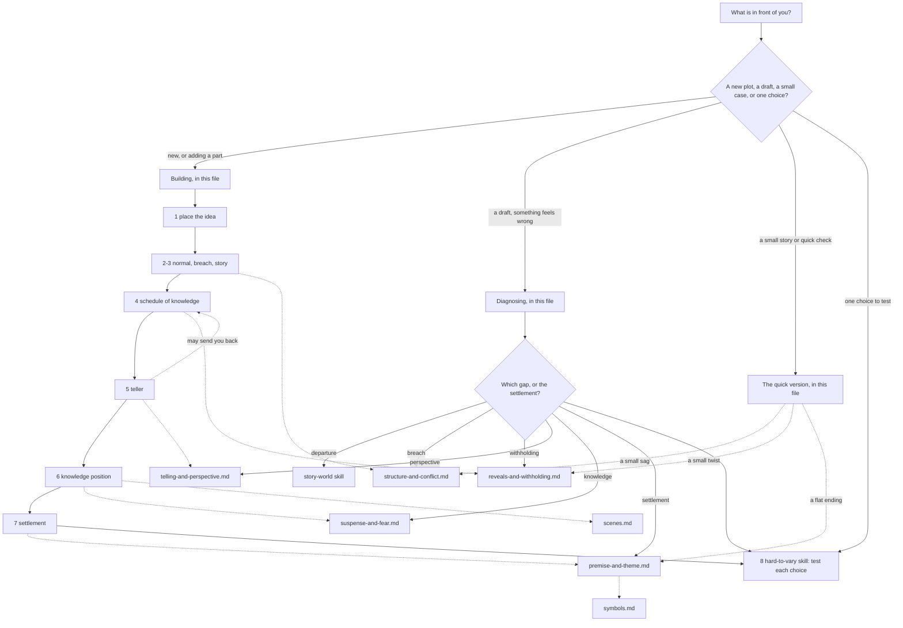

# Plot

A story is what happens. A plot is the order, selection and emphasis in which the audience finds it out. This skill builds plots and diagnoses them with the owner's Gap theory: a narrative is a stack of gaps that open and close over time, and the plot's job is to schedule them. It covers the breach and how it escalates, reveals, twists, mysteries and wonders, suspense and fear, narrators and point of view, endings, premise, theme, symbols, and the order and making of scenes.

**Built on.** The primary source is `sources/gap-theory-of-narrative.md`. This skill derives from it and does not change it; read the full text once per conversation before a first full run. A small case is one scene, one character, one choice or one named symptom. For a small case, or when another skill hands you one question, read only the theory passages cited in the sections you use. `sources/anticipation-theory.md` is this skill's second source, registered in `sources/README.md` as the source of its suspense module: it is the frame of `references/suspense-and-fear.md`, and should be read in full before that module's first full use. The skill also draws on the Implied World theory (`sources/implied-world-theory.md`), because plot schedules facts about the world as well as the story (Gap principle 4), and because the world's main departure should embody the story's question (Implied World principle 8, *thematic fit*). And on the Bond theory (`sources/bond-theory.md`): care is the first term of the suspense equation and has to be built before the threat. Three craft books fill in method in the modules, always in the workshop's own words: Truby, *The Anatomy of Story*; Egri, *The Art of Dramatic Writing*; McKee, *Dialogue*; and, for one rival, Truby's *The Anatomy of Genres*. Where a book disagrees with a theory, the module follows the theory and records the book's view as a rival.

**Words.** The theory's terms are used exactly as it defines them. *World*: what is possible, normal and valued. *Story*: what happens, in the order it happened, inner change included. *Plot*: the order, selection and emphasis in which the audience learns the story and the world. *Telling*: who or what delivers the plot (a narrator, a point-of-view character, a camera), with what knowledge and what bias; this skill calls that deliverer the *teller*. *Narrative*: the whole. The five gaps are *departure* (reality against the world), *breach* (the world's normal against what happens), *withholding* (story order against plot order), *perspective* (what happened against what the teller says) and *knowledge* (what the audience knows against what the characters know). Named with its layer (*the knowledge gap*), a gap is one of these five. The theories also say *gap* for any single open question inside a layer (Sternberg's suspense is "a gap about the future"; each rung of the fear ladder closes one), and this skill follows them in that looser use. (The Implied World theory also says *gap* for something left unfilled on purpose. The Gap theory itself joins the two: it says this is where worldbuilding's gaps and plot's gaps meet, and that a gap mentioned in passing and never pressed is a *wonder* (Part 2 section 4). What else counts as a gap, for example one never mentioned at all, is a question put to the owner.) Three plain words are added: a *fact* is anything about the story or world the audience can learn; a *reveal* is the moment a withheld fact reaches the audience, a character, or both; a *turn* is a point where the story changes direction. The world sets what things *cost* (Gap principle 2); the theory once calls this the *price*, but the workshop keeps *price* for the attention a departure takes (`story-world`), so this skill says *cost* (an owner question is open on this).

## The idea in one example

*Romeo and Juliet*. The story: two teenagers from feuding houses marry in secret. A street fight kills her cousin and gets him banished. She takes a drug that makes her seem dead, so she can slip away to him. The message explaining the plan never reaches him. He finds her in the tomb and kills himself; she wakes and does the same. The feud ends over their bodies.

Shakespeare's plot opens by telling the audience how it ends. That throws away one question (will they live?) and buys two things. Uncertainty moves from *whether* to *how*, so every hopeful moment is watched from above. And in the tomb the audience knows what Romeo does not: she is asleep. That is the knowledge gap with the audience ahead, which the Anticipation theory calls the suspense of helplessness. We fear *for* him and cannot warn him.

Now keep the story and change the plot. Withhold the ending and the sleeping-drug plan. The tomb becomes a surprise: a few seconds of it when she wakes, instead of a whole last act of helpless suspense. The events are the same; the narrative is not. The plot chose which gap the audience would live in.

Then test the choices with `hard-to-vary`. *Remove* the lost message: Romeo learns the plan, and the deaths do not happen, so the turn is held in place by it. *Swap* why it is lost (the play's quarantine for, say, a lame horse): the turn still happens. What is held is that it fails by chance, not by anyone's will; a villain who intercepted it would make a different story. *Flip* the settlement: the lovers live and the feud goes on. Now the ending gives the opposite answer to the question the world poses (can love live inside a feud?), so the play would mean something else.

## Where to look, and when

This file holds the method. The modules hold detail; open one only when its row applies.

| You are... | Open | To get |
|---|---|---|
| turning an idea into a plot, or adding a part | "The procedure" below, building | the order of decisions, from normal to settlement |
| looking at a draft where something feels wrong | "The procedure" below, diagnosing | symptom first, then which gap |
| working on a small story, or wanting a quick check | "The quick version" below | four questions for building; three checks for a small diagnosis |
| making a scene tense or frightening, or finding out why it is not | `references/suspense-and-fear.md` | the four terms, the fear ladder, knowledge positions, the ratchet, residue, prose against film |
| deciding when a fact comes out: a twist, a mystery, a clue, backstory, exposition, a set-up and its payoff | `references/reveals-and-withholding.md` | suspense, curiosity and surprise; mystery against wonder; reveals in sequence; exposition as ammunition; fair and unfair withholding |
| choosing who tells it: a narrator, a point of view, a frame, an unreliable teller | `references/telling-and-perspective.md` | kinds of teller and their settings, the character-narrator, fair play, what each medium makes cheap |
| making the breach escalate: the opening, the middle, crisis, climax, the jobs a plot must get done | `references/structure-and-conflict.md` | the core jobs of a plot, kinds of conflict, where to start, crisis, climax and resolution |
| working out what the story means, or stating a premise | `references/premise-and-theme.md` | the premise line, the claim (Egri's premise), moral argument, and theme as settlement |
| ordering scenes, or building one | `references/scenes.md` | scene order and weave, scene construction, beats and turns |
| using an image or object that keeps coming back | `references/symbols.md` | how a symbol gathers meaning, and how it ties to theme |
| testing one plot choice (a reveal's timing, a turn's cause), or whether it does any work | Building step 8 below; `.claude/skills/hard-to-vary/SKILL.md`, section 5 of its `references/by-domain.md` | remove, move, swap, flip, two routes |

When a small case matches a specific row, open that row's module; the quick version is for a small case no row names. In this skill the quick version also carries light first checks for three common rows (a sag, a twist that fails, a flat ending); they are the start of those rows' modules, not a substitute for them. In this skill the quick version also carries light first checks for three common rows (a sag, a twist that fails, a flat ending); they are the start of those rows' modules, not a substitute for them.

Exposition is split three ways. When a fact comes out is this skill's (`references/reveals-and-withholding.md`, section 5). How a line of talk carries it is `dialogue`'s (`.claude/skills/dialogue/references/what-dialogue-does.md`, section 7). How much of the world is shown is `story-world`'s (`.claude/skills/story-world/references/diagnosing-a-world.md`, section 6).

**Keeping the map true.** When a module is added, split or changed, update the table and the graph in the same edit. A module with no row is unreachable: give it a row or remove it.

**What belongs in this skill.** One test for any addition: does it help decide what happens, in what order, or when and through whom the audience learns it? How a world works goes to `story-world`, why the audience cares about a person to `character`, how a line is worded to `dialogue`, what a genre promises to `genre`. When in doubt, leave it out and say why.

## The stance

- **The audience rebuilds; it is never handed anything.** It infers the world from what is shown and the story from the plot (the theory's *nested inference*). Plan both inferences.
- **One story, many plots.** Before changing what happens, ask whether changing when the audience learns it would fix the problem.
- **Emphasis is a promise.** A question the telling lingers on, that characters chase and that keeps coming back, is a *mystery* and must be answered. One mentioned in passing and never pressed is a *wonder* and must be left open.
- **The teller sets the fair limits.** Hold back only what this teller could not know or would not say, or a wonder that was never promised an answer.
- **Show the normal before breaking it.** The world sets what the breach costs, and the audience has to see what could be lost before the threat arrives.
- **Books fill in; the theories decide.** Most book rules are fitted from past plays and films. Use them as patterns to question, and record where one rivals a theory.
- **Every load-bearing choice should be held in place.** A reveal that could come anywhere, or a turn whose cause could be cut without loss, is loose.

## The procedure

Read `sources/gap-theory-of-narrative.md` before a first full run in a conversation (for a small case or a handed-off question, see **Built on**).

### Building

Work in this order of logic, not necessarily the order of writing. Each step names the module with the detail.

1. **Place the idea.** An idea usually arrives as one piece of the stack: a strange world (the departure gap), a situation (the breach), a person who wants something (the story), a secret or twist (withholding), a voice (perspective), a scene where the audience knows more than the characters (knowledge), or an ending (the settlement). Name which piece it is, then build outwards through the steps below.
2. **The world's normal, and what breaks it.** Write the normal in two or three lines: what is possible, normal and valued here, and what things cost. Then the breach: what happens that breaks the world's *own* normal. In *The Hunger Games* a child's name drawn for the arena is routine, the normal; a girl volunteering in her sister's place is the breach, because in her district nobody volunteers. A breach that could happen in any world has arbitrary stakes. Building the world itself: `story-world`. Where to open, and how the breach escalates: `references/structure-and-conflict.md`.
3. **The story, in the order it happened.** Who wants what, what resists, what changes, inner change included. Write it in time order, starting before page one: the events that make waiting impossible when the plot opens belong to the story even if the plot never shows them. Want, need and care: `character`. The jobs a plot must get done: `references/structure-and-conflict.md`.
4. **The plot: a schedule of knowledge.** List the key facts of story *and* world. For each, write when the audience learns it, from whom, and with what emphasis. Draft this with a working teller in mind; step 5 may send you back. Choose its interest on purpose: *suspense* (they know what is at stake but not how it ends: show it early), *curiosity* (something happened that they have not been told: withhold a past fact) or *surprise* (they did not know there was a question: plant, hide, reveal). Then mark every open question as a mystery or a wonder and check that the emphasis matches. Detail: `references/reveals-and-withholding.md`.
5. **The teller.** Who or what delivers the plot, what they know and when they know it, and their bias. From that, write down what may fairly be held back. Then check step 4 both ways. Everything it holds back needs a fair ground: this teller could not know it, would not say it because of who they are, or it is a wonder. Everything it puts the audience ahead on must be something this teller can deliver, or use one of the three routes in `references/telling-and-perspective.md`, section 5. Where either check fails, change the schedule or the teller. Detail: `references/telling-and-perspective.md`.
6. **The knowledge position, scene by scene.** For each major scene: does the audience know more than, the same as, or less than the characters, and about what? Choose on purpose, and plan where, or whether, it shifts. Detail: `references/suspense-and-fear.md`; scene order and construction: `references/scenes.md`.
7. **The settlement.** Which mysteries close, which wonders stay open, how the normal at the end differs from the normal at the start, and what that cost. The theme is the story's answer to the question its world poses: write the question in one line and check that the ending answers it. Detail: `references/premise-and-theme.md`; images that carry it: `references/symbols.md`.
8. **Test each load-bearing choice** with `hard-to-vary`. For a craft note, use hard-to-vary lightly: its quick version (which carries the flip test) and the remove and swap tests in section 5 of its `references/by-domain.md`. Run its full procedure and report only when the writer asks whether a whole explanation holds up, such as their own account of why a draft fails. For every turn, *remove* its cause: would the turn happen anyway? Then it is placed, not caused. For every reveal, *move* it earlier and later: if nothing changes, its timing is loose. *Flip* the ending, two ways. If the story would mean the same, the settlement is doing no work. If the same set-up could lead just as convincingly to the opposite ending, the ending is not yet earned. *Two routes*: if two reveals or scenes do one job, keep both only if each has a second job.

### Diagnosing

1. **Pin down the symptom before explaining it.** To whom (which reader, which kind of reader), where (the page, scene or minute it starts), compared with what (what they expected, an earlier draft, a work that does it). "It drags" is not yet a symptom. "Two of three readers stopped in chapter six, where the earlier draft had the letter scene" is. If the writer has given only a pitch or a snippet and cannot be asked, do not stall. Say in one line what you are assuming (for example, that "the middle sags" means the chapters between the first turn and the last act, for any reader), treat the draft's own elements as the symptom, and turn each missing fact into a check the writer can run (have two readers mark the page where they first skimmed). This is hard-to-vary's rule: when facts are missing, do not guess; turn the missing fact into a test. If another skill has already pinned the symptom and hands you one question, take its pinning and go to the next step.
2. **Find which gap is mismanaged, or whether the settlement is.** First guesses, each to be tested:

| Symptom | Check first | Then open |
|---|---|---|
| "generic", "could be anywhere" | departure | `story-world` |
| "nothing is at stake", "why does this matter" | breach: the normal not shown, or its cost not set by the world; or care | `references/structure-and-conflict.md`; `character` |
| "confusing", "info-dump" | withholding | `references/reveals-and-withholding.md`, section 5; too much of the world on the surface: `.claude/skills/story-world/references/diagnosing-a-world.md`, section 6; facts in talk with no reason in the speaker: `.claude/skills/dialogue/references/what-dialogue-does.md`, section 7 |
| "I saw it coming", "predictable", "the twist is cheap" | withholding: a fact released too early, or a twist the teller could not fairly hide | `references/reveals-and-withholding.md`, sections 5 and 7; if readers predicted from the genre's habits rather than from a clue, `genre` (the genre file's section 11) |
| "the twist came from nowhere", "unearned" | withholding: planting (each fact the turn depends on shown at least twice before it), then the teller test, then whether the reveal changes what someone decides or what the audience expects (if neither, it is information, not a turn) | `references/reveals-and-withholding.md`, sections 2, 3 and 7; a villain barely on the page: `.claude/skills/character/references/opponents.md`, sections 1 and 7 |
| "the narrator cheated", "flat voice", "whose story is this" | perspective | `references/telling-and-perspective.md` (what the teller knows and their bias); how a narrator sounds: `.claude/skills/dialogue/references/voice.md`, section 8 |
| "no tension", "not scary", "I never worried" | knowledge, and the four terms of suspense | `references/suspense-and-fear.md` |
| "sags in the middle", "episodic" | first, a term of suspense at zero (care, uncertainty, time); then the breach not escalating, or no new facts arriving | `references/structure-and-conflict.md`, section 9, whose checks run in this order; `references/suspense-and-fear.md`, section 1; `references/scenes.md` |
| "the ending falls flat", "so what" | settlement | `references/premise-and-theme.md` |

3. **Ask the theory's five questions** of the draft. What is the normal, and what breaks it? Which open questions are mysteries and which wonders, and does the emphasis match? In each major scene, what does the audience know that the characters do not, and the other way round? Is anything held back "only because I want a twist, rather than because the teller couldn't or wouldn't say"? What has changed from the opening normal, and what did it cost?
4. **Build the rival diagnosis and tell the two apart.** Most symptoms have two plausible gaps. "No tension" may be the knowledge position, or no care. Name a change that would fix one and not the other: if letting the audience see the threat a scene earlier would help, the knowledge position was wrong; if more of the normal before the threat would help, care was. (If worse odds would help, a third candidate, uncertainty, was low.) Try the cheaper change first, on paper. Care is the `character` skill's, and its poke for telling care from the other terms is in `.claude/skills/character/SKILL.md`, Diagnosing step 7. Test the diagnosis itself with `hard-to-vary`, lightly, as in Building step 8.
5. **Fix the smallest thing that answers the symptom,** then check the fix against the symptom as pinned in step 1, and against the nearby scenes it must leave alone.
6. **Hand off** where the question crosses over: a world's rules to `story-world`; caring about a person, or a villain barely on the page, to `character`; the wording of a line to `dialogue`; a genre's promised beats, or a story that is predictable because it rides on its genre's defaults, to `genre`. A named symptom stays with this skill even when the whole outline or manuscript comes with it; for general notes on a whole work, `story-critique` leads if it is available, and this skill is consulted on its own area.

### Reply

The last step in both modes. Reply in this order, in proportion to the case: what is wrong or missing, ranked, each with its reason and where it shows; what works and should be protected; which choices are free (they could be otherwise, and the writer should say so or replace them) and which are held; the fix for the top one or two, concrete to this draft; what you assumed or are unsure of; one next step. For a rewrite, show it, then say what changed and why.

## The quick version

For a small case, four questions are enough. For a single choice (a reveal's timing, a turn's cause), use Building step 8 instead.

1. What is the world's normal, and what breaks it?
2. Take the fact that matters most. When does the audience learn it, and is that suspense, curiosity or surprise on purpose?
3. Is each open question a mystery or a wonder, and does the emphasis match?
4. By the end, what has changed from the opening normal, and what did it cost?

For a small diagnosis that matches a row of the Diagnosing table, these are the first checks in that row's module. Pin the symptom in one line (Diagnosing step 1, saying what you assumed), then run only the checks for it, in the section named:

1. **A sag.** Run both checks, and do not stop at the first yes. Is a term of suspense at zero (care, uncertainty, time)? Does a stretch bring nothing new: no harder step in the same want, and no new fact? Both may say yes at once; for each yes, name the one change that would fix that cause and not the others, as section 9 says. (`references/structure-and-conflict.md`, section 9.)
2. **A twist that fails.** Guessed: which fact came out too early? From nowhere: did each fact it depends on appear at least twice before it, in different scenes, and could this teller fairly have held it back? Either way: does the reveal change what someone decides or what the audience expects? If neither, it is information, not a turn. (`references/reveals-and-withholding.md`, sections 2, 3, 5 and 7.)
3. **A flat ending.** Question 4 above, then `references/premise-and-theme.md`, section 8 (the settlement).

Then hand off as in Diagnosing step 6 where the answer lies in another skill or a genre profile, and reply as in the Reply step.

## Traps

- **Calling a list of events a plot.** Events in time order are the story. The plot is the schedule of what the audience learns; until that exists, nothing has been plotted.
- **Holding back only for a twist.** If the teller could know it and would say it, and it is not a wonder left open, hiding it is cheating, and a second reading shows it.
- **Emphasis that promises what the ending will not pay.** Pressing a question you mean to leave open is betrayal; explaining a wonder is deflation.
- **Surprise by default.** A hidden threat buys seconds; a shown one buys minutes. Truby's method hides the opponent's attacks; check each against the suspense it could have bought instead.
- **A breach with no normal.** Opening on the explosion before the audience knows what could be lost. See the rival with Egri and Truby in `references/suspense-and-fear.md`, section 11.
- **Explaining an unpinned symptom without saying what you assumed.** An account of "it drags" that says neither where and for whom, nor what you took those to be, cannot be wrong, so it cannot help.
- **Adding conflict to every flat stretch.** Egri puts boredom down to missing conflict. The workshop reads the owner theories as naming other causes: no care, no uncertainty, no time (the threat not shown early enough), too many new things to learn at once (the Implied World theory's attention budget). The rival: `references/suspense-and-fear.md`, section 11.
- **Letting a checklist decide.** Truby's steps and Egri's build order are fitted from past plays and films. A missing step is a question to ask, not a fault to fix.
- **Cutting the world to serve the hero.** Truby's filter, which cuts every scene not moving the hero, can strip out the world's own business, which the Implied World theory says makes it feel real. A scene of the world at its own business is not a scene that changes nothing, in the workshop's reading: it teaches a departure, or does the Implied World theory's work of indifference and surplus; keep it short, and let it ride inside a working scene where it can (`references/scenes.md`, section 1). The rival: `.claude/skills/story-world/references/world-from-story.md`, section 11.
- **Settling everything, or nothing.** Close every gap and nothing stays with the audience; close none and the events never become a shape.
