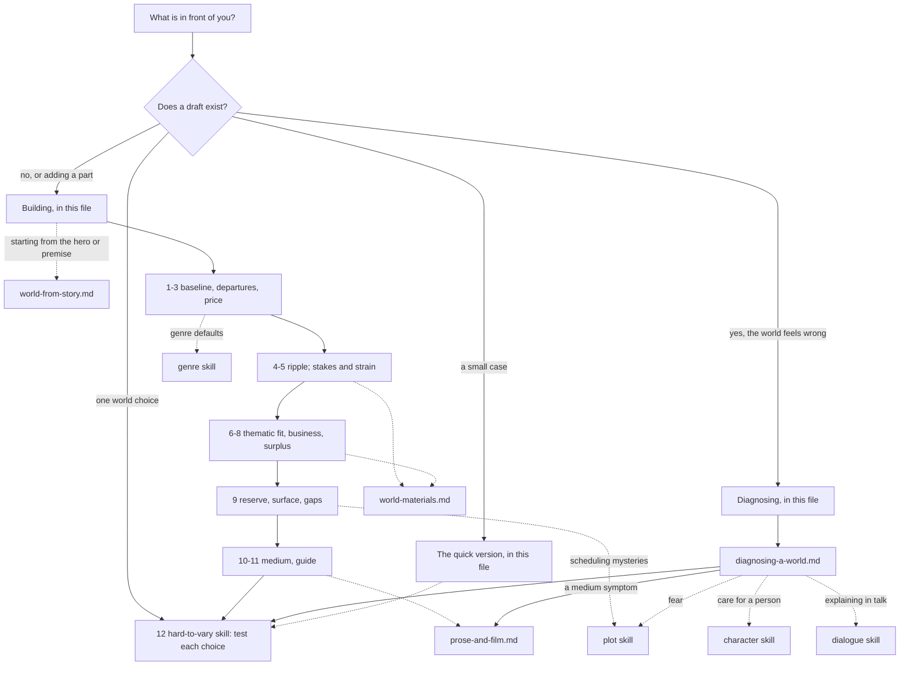

# Story world

A fictional world is never on the page or the screen. The audience infers it from what it is shown and fills in everything else from the world it already knows. This skill builds worlds and diagnoses them on that basis. What you design is the list of differences. Each difference must pay for the attention it takes and show its consequences, the world must have business of its own, and most of what you build stays under the surface. It covers invented worlds and realist ones (a Regency village is a world too): their rules, societies, technology, magic, places and time, and how much of them to show in which medium.

**Built on.** The primary source is `sources/implied-world-theory.md`, all of it: the six key terms, the eight principles, the medium corollary, and its three predictions (the expansion paradox, the guide that worlds with many departures need, fans gathering at the gaps). This skill derives from it and does not change it; read the full text once per conversation before a first full run. It also draws on the Gap theory (`sources/gap-theory-of-narrative.md`): the departure gap, between reality and the world, which produces wonder and strangeness; principle 2, Breach (the world decides what counts as an event, what characters want and what things cost); principle 3, Pressure (a world shows itself best through what it does to people under strain); and the promise that every open question is a mystery or a wonder, applied to facts about the world. It draws on the Anticipation theory (`sources/anticipation-theory.md`): principle 4, lost refuge, and its reading that Horror is a world whose rules turn against the people living in it. And on the Bond theory (`sources/bond-theory.md`), which turns principle 4 round: the world shouldn't care about the hero, but the audience must. Craft books fill in method in the modules, always in the workshop's own words: Truby, *The Anatomy of Story* (the story world chapter and the world parts of the symbol chapter) and, for a few points, *The Anatomy of Genres*; Egri, *The Art of Dramatic Writing*, on environment; McKee, *Dialogue*, on exposition and the stage. Where a book disagrees with a theory, the module follows the theory and records the book's view as a rival.

**Words used in one sense only.** From the theory: the *baseline* is what the audience assumes by default, the real world plus the habits of the genre. A *departure* is any way the fictional world differs from the baseline (a magic system, a political order, a ruined climate, a slang); a *rule* is a departure about how something works. The *surface* is what is actually shown or stated. An *implication* is what the surface logically requires: if there are border guards, someone pays them. The *reserve* is what the creator knows but never shows. A *gap* is what nobody fills in, left open on purpose for the audience; in this skill *gap* always means that. The Gap theory's five gaps are named in full when meant (the departure gap, the breach), and an open question about the world is a *mystery* if the story promises to answer it and a *wonder* if it promises to leave it open. A few plain words are added. A departure's *price* is the attention the audience spends learning it (principle 2, the attention budget). Its *cost* is what it demands of the people who live with it (the Gap theory's "what things cost"; that theory also says *price* for this, but this skill keeps *price* for attention). A *consequence* is one knock-on effect of a departure, and *ripple* is the principle that a departure convinces in proportion to its consequences. A world's *business* is whatever it is doing that has nothing to do with the protagonist (principle 4, indifference). *Surplus* is detail that serves no purpose, in the plot or anywhere else; its only job is to signal that the world is real (principle 5). A *guide* helps the audience into a world with many departures: an *outsider* who learns alongside them, or an *outside aid* such as a map, a glossary or an opening crawl.

## The idea in one example

*Children of Men* (the 2006 film). The baseline is Britain some twenty years ahead: roads, trains, pubs, television news, rain. The film spends on one main departure: no child has been born anywhere for eighteen years. Nearly everything else it lets the baseline carry.

Then it ripples that one departure through ordinary life and explains none of it. The opening news story is the death of the youngest person on earth, mourned like a celebrity. The state advertises suicide kits on television. A minister gathers the world's great paintings and statues into a guarded power station, for no one to inherit. None of this needs a speech, because each follows from the one rule. The world also has business of its own: a bomb goes off in the café the hero has just left, in a conflict that has nothing to do with him. And the main departure is the story's question. A world without births asks whether hope can exist without a future, so the first pregnancy in eighteen years is not a plot device. It is the question, made into a person.

What the film leaves open matters as much. Nobody ever says why the births stopped. That gap has edges: it struck everywhere at once, eighteen years ago (the opening news story fixes the date), and what failed was human fertility itself, so the audience knows exactly what kind of event is unexplained even with no cause given. The film never makes finding the cause anyone's goal, so it stays a wonder.

Now test the choices with `hard-to-vary`. *Remove* the departure: a police state full of refugees is left, but the pregnancy is no longer a miracle and the story has no question. *Swap* it for a near neighbour, say a plague that kills everyone over sixty: the world is still grim, but it has a future, and the question changes. *Swap* the unstated cause, a virus for a failed vaccine: nothing changes, because the cause is free. What is held in place is that the next generation has stopped arriving. *Flip* the gap: explain the cause in a scene with a scientist. The wonder is answered, which the Gap theory calls deflation: the world shrinks, the film gains someone to blame, and its question drifts from hope to guilt. Every part that matters is held, and the part left open is left open on purpose.

## Where to look, and when

This file holds the method. The modules hold detail; open one only when its row applies.

| You are... | Open | To get |
|---|---|---|
| building a world, or adding a part to one | "The procedure" below, building | the order of decisions, from baseline to guide |
| looking at a draft where the world feels wrong | "The procedure" below, diagnosing, then `references/diagnosing-a-world.md` | each symptom, the principle behind it, the question that confirms it and the repair, with worked cases and rival diagnoses |
| checking a small world quickly | "The quick version" below | four questions |
| deciding how the world reaches the audience in a book, a film or a play, or moving it between them | `references/prose-and-film.md` | what is cheap and expensive in each medium, where surplus and gaps live, the teller as filter, adaptation, each medium's typical failure |
| growing the world out of the story: the hero, the premise, one bounded space, places that change as the hero changes | `references/world-from-story.md` | Truby's and Egri's methods, tied to breach, pressure and thematic fit, and the rival over indifference |
| choosing what the world is made of: land, weather, buildings, a model or map, a change of size, a crossing between worlds, tools, seasons, rituals, story time | `references/world-materials.md` | each material as the job it can do and the principle it serves |
| finding what a genre's audience assumes by default | `.claude/skills/genre/references/genres/<genre>.md`, section "The baseline" | that genre's defaults, which your departures are measured against |
| deciding when a fact about the world comes out | `.claude/skills/plot/references/reveals-and-withholding.md` | suspense, curiosity or surprise; mystery against wonder |
| making a world frightening | `.claude/skills/plot/references/suspense-and-fear.md` | lost refuge; show the rules, hide the thing |
| checking one world choice: does it do any work? | Building, step 12, below; then `.claude/skills/hard-to-vary/SKILL.md`, section 5 of its `references/by-domain.md` | remove, swap, move, flip, poke; the check that keeps surplus |

**Keeping the map true.** When a module is added, split or changed, update the table and the graph in the same edit. A module with no row is unreachable: give it a row or remove it.

**What belongs in this skill.** One test for any addition: does it help decide how the world differs from the baseline, what those differences cost and cause, or how much of the world reaches the audience and by what route? What happens in the world goes to `plot`, why the audience cares about a person to `character`, how a line is worded to `dialogue` (designing a slang is a departure and belongs here; putting it into lines belongs there), what a genre promises to `genre`. When in doubt, leave it out and say why.

## The stance

- **Build the differences, not the world.** The audience arrives with a complete world. Design what differs and let the baseline carry the rest.
- **Every departure has a price.** Spend on a few that matter. A world with nothing spent feels generic; a world with too much spent loses the audience.
- **A departure is proved by its consequences, not by its explanation.** Three consequences nobody remarks on convince more than a page of how it works.
- **The world doesn't care about the hero; the audience must.** Give the world business of its own, and leave building care to `character`.
- **Build the whole iceberg; show the tip.** The reserve is for the writer. The audience should feel its weight, not read it.
- **Leave gaps on purpose, with edges.** The audience should know what kind of thing is missing.
- **Realist worlds are worlds.** They lean harder on the baseline, but their few departures (an entail, a class code, a company town's rules) still set what everything costs.
- **Books fill in; the theories decide.** Truby designs the world outward from the hero; the theory insists on business of its own. Use his method as a working order and keep the world's own life (the rival is in `references/world-from-story.md`, section 11).
- **Surplus is allowed to be loose.** `hard-to-vary` finds parts held in place by a job. Surplus exists to do no plot job, so its specifics are free as long as they belong to this world.

## The procedure

Read `sources/implied-world-theory.md` before a first full run in a conversation.

### Building

Work in this order of logic, not necessarily the order of writing. A writer who starts from the hero or the premise can find the places first with `references/world-from-story.md`; these steps then check the result.

1. **Name the baseline.** Write down what the audience will assume without being told: their own world, plus the habits of the genre (for a period genre, including its usual picture of the past). Say "space station" or "elven city" and the audience furnishes it from a hundred earlier stories. The `genre` skill gives each genre's defaults. For a period or foreign setting the baseline is still the audience's own world, and the period's differences are departures you must know: list what a person of that world takes for granted (manners, money, belief, speech), and if you can't fill the list, research more or move closer to what you know *(Egri, built)*.
2. **List the departures. The list is the design.** Everything that differs from the baseline, large and small: rules, institutions, customs, names, slang, creatures, places, history. Mark one as the *main* departure. A realist story's list may be short (in *Pride and Prejudice*, an estate that can pass only to a male heir), but it is never empty, or the story could happen anywhere.
3. **Price each departure.** Each takes attention the plot and the characters also need. Keep the few that matter and turn the rest back into baseline. A departure matters if it does one of the jobs in steps 4-8 (sets a cost, carries the question, gives the world business of its own) or is cheap surplus; run step 12's *remove* test here, not only at the end. A departure the audience can learn from what it already knows is cheap: a change of scale, or two familiar systems fused (a boarding school fused with a wizards' guild). If many must stay, plan to spread them: in steps, with a half-familiar place before the strange one *(Truby, fitted from the Harry Potter books)*, and each met at the moment someone runs into it rather than delivered while the story waits *(Truby, Genres, built)*. Materials that are cheap because the audience already reads them: `references/world-materials.md`, section 2.
4. **Ripple each kept departure into ordinary life.** For each, write what it changes about work, money, food, love, law, death and speech, and what people now do without thinking. Follow it to the traffic jam, not just the car (Pohl's line, in the theory). Then its costs: what does using or breaking it demand of people? A rule whose breaking costs nothing cannot make danger *(Truby, Genres, asserted; the Anticipation theory supplies the mechanism: the audience predicts danger from a threat's rules)*. Last, poke it for consequences you did not plan: what does it make possible that would dissolve the story? Close each such exit with a cost, a limit stated early, or a motive inside the story, or change the departure (the theory's Time-Turner case).
5. **Let the world set the stakes, and show it under strain.** From the departures, write what counts as an event here, what people want, and what things cost (Gap theory, principle 2). In a world full of dragons, a dragon attack might be weather. Then plan where the world shows itself through what it does to someone under pressure rather than through explanation (principle 3): the audience learns what Gilead is from what it does to Offred. The breach that starts the story must break *this* world's normal; building it is `plot`'s work.
6. **Make the main departure carry the story's question.** Write the question in one line and check that the main departure embodies it (principle 8). *The Handmaid's Tale* builds a state around controlling fertility because the book is about who owns a body. If yours doesn't fit, change the departure, or change the question to the one the world already asks.
7. **Give the world business of its own.** Ask the theory's test: if the protagonist died in chapter one, what would this world be doing next week? Write three things. Name one large force (a war, a shortage, a new machine) that has nothing to do with the hero's goal, and show it reaching his household anyway *(Egri, built)*. Give minor characters wants and troubles of their own.
8. **Plan the surplus, delivered in passing.** Choose details that serve no purpose in the plot and let characters who have lived with them all their lives take them for granted: a clause, not a paragraph; the background of the frame, not a close-up. Heinlein's door that dilates tells more about a society than a paragraph on door technology. Check that each detail belongs to this world.
9. **Build the reserve; choose the surface; choose the gaps.** Write down the reserve: history, geography, how the institutions and rules work. Choose the few pieces that reach the surface, and the glimpses that make the rest felt (Tolkien's songs about stories we never hear). Then choose what stays open, and give each gap edges: a war, a lost people, an older magic. Mark each open question as a wonder (mentioned in passing, never pressed) or a mystery (pressed, and answered); scheduling mysteries is `plot`'s work. If you are adding to an existing work, first list the wonders it left open and do not answer them; expand sideways (`references/diagnosing-a-world.md`, section 7).
10. **Check the medium.** Prose builds by adding and film by taking away. Move each world fact to where the medium makes it cheap: `references/prose-and-film.md`.
11. **Decide the guide, if departures are many** (the gauge: count the departures a reader new to the genre must learn before the first major turn, as in `references/diagnosing-a-world.md`, section 3). An outsider who learns alongside the audience (Harry, Alice, Dorothy, Neo), or an outside aid (the opening crawl, the glossary, the map). Without one the story feels hard going. The outsider need not be the hero, and a crossing between worlds can mark where the baseline stops applying (`references/world-materials.md`, section 8).
12. **Test each load-bearing world choice** with `hard-to-vary` (section 5 of its `references/by-domain.md`). *Remove* a departure: if nothing breaks, ask whether it is surplus (it costs a clause, is taken for granted and belongs to this world); if so, keep it, and if not, it is idle: turn it back into baseline. *Swap* it for a near neighbour: if the story works as well, name what the two share, because that is what is really held. *Move* the whole story to the genre's default world or the audience's own, every departure gone at once: if the conflict survives unchanged, the world is not doing its job *(the Gap theory, principle 2: a breach with no world could happen anywhere; Egri builds the same test from one play)*. *Flip* a gap: fill it, and see whether the story shrinks.

### Diagnosing

1. **Pin down the symptom before explaining it.** To whom (which readers; genre regulars bring more baseline than readers new to the genre, so one page can be generic to one and overwhelming to another), where (the page, scene or minute it starts), compared with what (a work they name, an earlier draft, what they expected). "The world feels thin" is not yet a symptom. "The two readers who never read Fantasy stopped in the council chapter, where eleven noble houses are named" is.
2. **Map the symptom to the principle.** First guesses, each to be confirmed with the question in `references/diagnosing-a-world.md`:

| Symptom | Points first to | Section |
|---|---|---|
| "generic", "seen it before", "could be anywhere" | spending nothing: the baseline does all the work (principle 1) | 3 |
| "lost", "too much to learn", "hard going" | overspent (principle 2), or no guide | 3 |
| "just a coat of paint", "costume" | no ripple (principle 3) | 4 |
| "why don't they just...?", "that rule breaks everything" | a consequence nobody planned (principle 3) | 4 |
| "the stakes feel arbitrary", "nothing costs anything" | nothing in the world sets what things cost (Gap theory, principle 2) | 4 |
| "a backdrop", "the town is only there to be saved" | set-dressing: no business of its own (principle 4) | 5 |
| "consistent, but it doesn't feel real" | no surplus (principle 5) | 5 |
| "info-dump", "lore dump", "as you know" | the reserve dumped on the surface (principle 6) | 6 |
| "shallow", "nothing underneath" | no reserve, or all of it shown (principle 6) | 6 |
| "vague", "I can't tell what's possible" | gaps without edges, or rules never shown (principle 7) | 6 |
| "it got smaller as it got bigger" | gaps turned into canon (the expansion paradox) | 7 |
| "great world, but what is it about?" | world and theme side by side: no thematic fit (principle 8) | 8 |
| "should be frightening, isn't" | the world's rules never turn on its people | 9 |
| "works in the book, not in the film" | the medium | `references/prose-and-film.md` |

3. **Build the rival diagnosis and tell the two apart.** Most symptoms have two plausible causes. "Readers are lost" may be too many departures, no guide, or rules never shown. Name a change that would fix one and not the others, and predict what readers would say before trying it (`references/diagnosing-a-world.md`, section 10).
4. **Test the diagnosis with `hard-to-vary`.** Remove or swap the suspect departure on paper and say what would change for the reader. If the prediction is the same either way, the diagnosis is doing no work.
5. **Fix the smallest thing that answers the symptom.** Most world faults are fixed by cutting, delaying or moving facts, not by inventing more. Check the fix against the symptom as pinned in step 1, and against what it must leave alone.
6. **Hand off** where the question crosses over: when a world fact comes out, or a reveal about the world falls flat, to `plot`; readers who don't care what happens to anyone to `character`; explaining done in talk to `dialogue` (`.claude/skills/dialogue/references/prose-stage-screen.md`, section 8); a genre's usual world and promises to `genre`. For a critique of a whole work, `story-critique` leads if it is available, and this skill is consulted on the world.

## The quick version

For a small case, four questions are enough.

1. What does the audience assume here without being told, and which few departures actually matter (remove each: does something break, or is it surplus that belongs here)?
2. Take the main departure. Name three consequences in ordinary life, what it costs people, and the question it asks.
3. If the protagonist died in chapter one, what would this world be doing next week?
4. What have you built that the audience never sees, and which gap is open on purpose, with what edges?

## Traps

- **Inventing everything.** The audience already has a world. Every departure put on the surface that the story didn't need is price with no return; the reserve can be as large as you like.
- **Mistaking a long lore document for depth.** Depth is what the audience senses beneath the surface, not how much is shown; a lore document helps only if glimpses let its weight be felt.
- **Showing the reserve because it was hard to build.** Build as much as you like; show the tip.
- **Explaining a departure instead of following it.** An explanation is one fact; consequences are a system.
- **A world that exists only where the camera points.** Taking Truby's method literally (every place expresses the hero) produces it. Keep his method as a working order and keep the world's own business.
- **Giving every detail a meaning.** A world where every object is a symbol reads as a diagram. Keep a share of detail that means nothing.
- **Cutting surplus because it does no plot job.** That is its job. Test it for whether it belongs to this world, not for what it does for the plot.
- **Gaps without edges.** "Something happened long ago" is vagueness, not a gap.
- **Filling every gap.** In a sequel, a prequel or an adaptation, each gap filled turns a wonder into canon, and the world can shrink as it grows.
- **An outsider who asks about everything.** In a world with few departures the outsider has little to learn, and the questions turn into explanation for the audience's sake.
- **Diagnosing before pinning the symptom.** An account of "the world feels thin" that doesn't say for whom and where cannot be wrong, so it cannot help.
- **Letting a checklist decide.** Truby's world exercise builds and adds; it has no step for what to hold back. The theory's reserve and gaps are that step.
