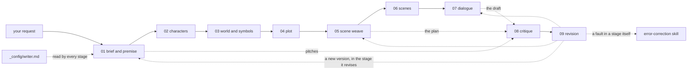

# Where to go

This file routes a request to the part of the workshop that handles it. It is the second of five layers of instructions (`CLAUDE.md` is the first; the layers are explained in `stages/how-stages-work.md`, section 1). Read it after `CLAUDE.md`, pick the row that fits, and open only what that row names.

The workshop does three kinds of work:
- **Making a story, stage by stage.** A project goes through nine numbered stages in `stages/`, from brief and premise to revision. Each stage has one job, a contract saying exactly what it reads, does and writes, and a stop after it where you can read and edit what it made before anything else runs.
- **Answering a craft question directly.** One scene, one character, one line, one choice, or a named symptom in a draft ("my villain is flat"): the craft skills answer these without the stages.
- **Looking after the workshop itself.** Adding a source, and finding and removing the workshop's own errors.

## Where to look, and when

| You want to... | Go to | It reads first |
|---|---|---|
| start a new story, or take an idea towards a draft | stage 01 | `stages/01-brief-and-premise/CONTEXT.md` |
| bring your own premise or draft into the stages | stage 01, which writes a short brief and takes your premise or draft in instead of writing rivals (its step 5) | `stages/01-brief-and-premise/CONTEXT.md` |
| carry on with a project | its project log, to find where it stands, then the next stage's contract (every stage reads the log first) | `stages/01-brief-and-premise/output/<project>/project-log.md` |
| work on one part of a project: the cast, the world and its symbols, the plot, the scene list, the scenes, the dialogue | that stage (02 to 07) | the stage's `CONTEXT.md` |
| get notes on a project's pitches, plan or draft, including one named symptom in it ("the monster feels flat") | stage 08, with a critic for that symptom where there is one, then stage 09 | `stages/08-critique/CONTEXT.md` |
| act on notes, or on your own feedback | stage 09 | `stages/09-revision/CONTEXT.md` |
| ask about one scene, character, line or choice, or diagnose one named symptom, outside a project | the craft skill whose description fits: `plot`, `character`, `story-world`, `dialogue`, `genre` | the skill's `SKILL.md` |
| get a full critique of a whole work outside a project | `story-critique`, when your Claude account has it (it is not in this repository); otherwise the craft skills, one area at a time. To have it critiqued through the stages instead, bring it in as a draft (the row above on your own premise or draft) | its own instructions |
| test whether an explanation, or a choice in a story, is doing real work | `hard-to-vary` | `.claude/skills/hard-to-vary/SKILL.md` |
| add a theory, a revised theory, a book or an article | `add-source` | `.claude/skills/add-source/SKILL.md` |
| deal with anything in the workshop that may be wrong: a check fails, a commit is stopped, you object | `error-correction` | `.claude/skills/error-correction/SKILL.md` |
| change your standing preferences (medium, length, voice, how the work runs) | your settings | `_config/writer.md` (the questions are in `_config/questionnaire.md`) |
| change how a stage works | its contract, through `error-correction`, since that changes what the workshop says | the stage's `CONTEXT.md` |

When a row names a skill, the skill's own "Where to look, and when" table takes over from here.

## The stages

| Stage | Its one job | The craft it leans on |
|---|---|---|
| 01 brief and premise | turn your request into a brief, write rival premises, choose one | `plot` (premise), `genre` |
| 02 characters | the cast, the hero's change, the opponents, the moral argument | `character`, `plot` (theme) |
| 03 world and symbols | the world the story needs, and the images that carry its meaning | `story-world`, `plot` (symbols) |
| 04 plot | the structure, the reveals, the teller, the genre's beats | `plot`, `genre` |
| 05 scene weave | the list of scenes (or episodes), in order: the plan | `plot` (scenes) |
| 06 scenes | draft each scene as action | `plot` (scenes), `story-world` (medium) |
| 07 dialogue | write and test the talk | `dialogue` |
| 08 critique | independent critics, each looking for one kind of problem | every craft skill, `hard-to-vary` |
| 09 revision | answer every finding, make the next version, log what changed | `error-correction` (for the workshop's own faults) |

Every arrow passes through a review stop: the run pauses, you read and edit, and you decide what runs next. The rules every stage shares (the layers, review stops, versions, markers that trace each part to its source, the Verify section, stale outputs, your edits, helper agents) are in `stages/how-stages-work.md`, and each rule is kept there only.

**Keeping this map true.** When a stage is added, split, renamed or removed, change this table, the graph, the stage table in `README.md` and every contract that names it, in the same edit.
