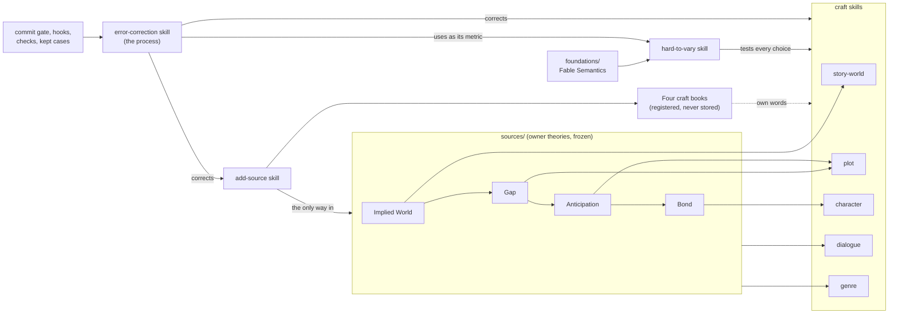

# StoryTest: a story workshop

A set of Claude Code skills for building and testing stories. They are grounded in four theories of narrative written by the repository owner, sharpened by a test for whether a choice is doing real work ("hard to vary"), and filled in with ideas from four craft books, used in the workshop's own words. The workshop also corrects its own errors as it goes: **error correction is the process, and hard to vary is the metric** it uses to judge each step.

## How the pieces fit

A worked example first. Suppose a writer asks: *"My villain feels flat. Why?"*

1. The **`character`** skill takes the question. Its frame is the owner's **Bond theory**: audiences care about a character because of the relationship the story builds (time together, access to the mind, understanding the want, fearing the loss), and for a villain, indifference is the enemy, not dislike.
2. It checks the villain against the theory's ten levers, and uses the book-derived module on building a cast (from Egri and Truby, in own words) to test whether the villain is a person or a function.
3. Each suggested fix is tested with the **`hard-to-vary`** skill: if the villain's backstory could be swapped for any other and nothing in the story changed, that backstory is doing no work.
4. If the fix is in how the villain talks, the **`dialogue`** skill takes over. If it is in when the audience learns what the villain wants, the **`plot`** skill does.
5. Before replying, the skill checks its own notes: would each fit any story, would it be as sure of the opposite, and what does each fix give up or put at risk?

And if the workshop itself gets something wrong, say a rule in the character skill misreads the Bond theory, the **`error-correction`** skill takes it:
1. The sign is turned into a criticism (what is wrong, on what grounds) and measured with hard to vary.
2. It asks where the error got through, and changes that stage as well as the file.
3. The change must show what it fixed, what still works (the kept cases, rerun) and what it lost.
4. The commit gate will not accept the change without a review receipt that names an agent that did not make it and carries its report (the gate cannot tell whether that agent really ran, so this part is on trust, with a trace). The correction is recorded in `27 Corrections.md`.

## What is where

| Place | What it holds | Changes? |
|---|---|---|
| `foundations/claude-fable-semantics.md` | The owner's formal theory of explanation | Frozen |
| `sources/*.md` (apart from `README.md`) | The owner's four theories of narrative | Frozen; revisions are added as new files |
| `sources/README.md` | The register of every source, including the books | Updated as sources arrive |
| `sources/raw/` | Local copies of books while they are read | Never committed (git ignores it) |
| `.claude/skills/hard-to-vary/` | Tests whether an explanation or a creative choice is doing real work | Brought into line when the foundation is revised |
| `.claude/skills/add-source/` | How a new source comes in, plus the ebook converter, the copying check and the map check | Improved freely |
| `.claude/skills/error-correction/` | The process for finding and removing the workshop's own errors: the loop, the record, reviews and briefs, the rule card and rival form, the term sheet, and the machine checks (`scripts/`) | Improved through its own process |
| `.claude/skills/story-world/` | Building and diagnosing a fictional world | Improved freely; never contradicts its theory |
| `.claude/skills/plot/` | What happens, in what order, what the audience knows when; suspense; theme | Same |
| `.claude/skills/character/` | Making an audience care; heroes, opponents, casts, change | Same |
| `.claude/skills/dialogue/` | Writing and fixing talk: what each line does, subtext, voice | Same |
| `.claude/skills/genre/` | What a genre promises and how to meet or twist it; one file per genre | Same |
| `CLAUDE.md` | The working rules every agent reads first, and a table of what enforces each | Changed with a review, like a skill |
| `StoryTest - project story.md` | The project's goal, state, word list and numbered log | Added to, never rewritten (a check enforces it) |
| `22 Questions - meanings only you can settle.md` | Places where the theories can be read more than one way, and other points only the owner can settle; each numbered, with a status | Answered by the owner; the skills then follow |
| `26 Test - The Catch - two versions.md` | The first real test: the owner's screenplay in two versions, with a dated correction and the checks run on its notes | Corrected by dated notes, never silently |
| `27 Corrections.md` | Every error found in the workshop: the kinds, and what catches each now; each correction, open or closed; and the errors from before it existed | Added to; a correction's status changes when it closes |
| `kept-cases/` | Eleven short story problems with what a good answer must and must not do, and the record of every run | Cases never changed to make a skill pass; runs added, never replaced |
| `.claude/agents/` | Four reviewers that read and report: theory-checker, use-tester, copy-checker, case-grader. All are told never to edit; case-grader cannot, and the other three can run commands, so for them it is on trust | Changed with a review |
| `.claude/reviews/` | Review receipts: one per reviewed change, named by the change's fingerprint; `kept/` holds reviewers' reports and other working records kept word for word | Added to |
| `.claude/settings.json`, `.claude/hooks/` | Hooks Claude Code runs by itself: refuse edits to frozen files; at session start, switch on the commit gate and look again at the commits since the last one it approved; refuse the usual ways round the gate; and remind the agent of the claim check after each commit | Changed with a full review, in a commit of its own; the checks' own test reruns |
| `.githooks/` | The commit gate: before every commit and merge commit, git runs the checks of the last commit the gate approved (found by walking back along the main line) on exactly what is being committed, compared with that commit, asks for the review receipt, and looks again at the commits since then; `prepare-commit-msg` stamps each commit it passes | Same |
| `.gitattributes` | Tells git never to change the frozen files' line endings, so their fingerprints are the same on every machine | Same |

**Not in this repository:** `story-critique`, a separate skill in the owner's own Claude account for full critiques of a whole work. The craft skills name it as the lead for whole-work critiques when it is available, and consult each other for focused questions. Without it, the craft skills still work; a whole-work critique then runs through them one area at a time.

## The rules

- **The owner's theories come first.** A craft book adds detail. Where it disagrees with a theory, the skill follows the theory and records the book's view as a rival.
- **Frozen sources stay frozen.** Improve the skills, never the sources.
- **No copyrighted text in the repository.** Books are read locally from `sources/raw/`, used in own words, and checked with `overlap_check.py` before anything is committed.
- **Every module is reachable.** Each skill has a "Where to look, and when" table; a file without a row there is removed or given one.
- **Nobody grades their own work.** A change to what the workshop says needs a review by an agent that did not make it, and the commit gate asks for its receipt.
- **Not run is never passed.** A check that could not run says so.

**Switching on the commit gate by hand.** Claude Code sessions switch it on by themselves. In any other copy of the repository, run `git config core.hooksPath .githooks` once in the repository folder. It needs `python3`. A commit made where the gate is off (or on GitHub) carries no stamp. When it reaches a copy where the gate is on, whatever it got wrong in the files stops the next commit until it is put right (apart from a check it loosened, which is judged only by the planted-fault test and its late review), and it needs a review receipt if it changed a reviewed file. The gate stops most honest mistakes and shortcuts; those it is known not to stop, honest routes included, are listed in the error-correction skill's references/checks-and-cases.md, section 2, "What the gate cannot do". It cannot stop an agent set on getting round it, since it is made of files in this repository (question S10).
