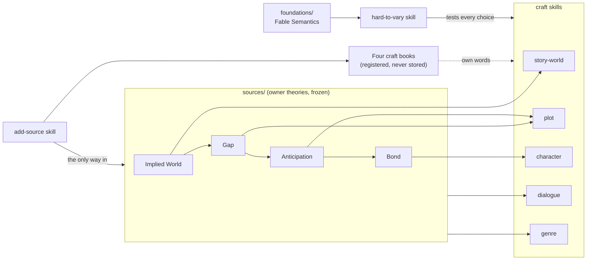

# StoryTest: a story workshop

A set of Claude Code skills for building and testing stories. They are grounded in four theories of narrative written by the repository owner, sharpened by a test for whether a choice is doing real work ("hard to vary"), and filled in with ideas from four craft books, used in the workshop's own words.

## How the pieces fit

A worked example first. Suppose a writer asks: *"My villain feels flat. Why?"*

1. The **`character`** skill takes the question. Its frame is the owner's **Bond theory**: audiences care about a character because of the relationship the story builds (time together, access to the mind, understanding the want, fearing the loss), and for a villain, indifference is the enemy, not dislike.
2. It checks the villain against the theory's ten levers, and uses the book-derived module on building a cast (from Egri and Truby, in own words) to test whether the villain is a person or a function.
3. Each suggested fix is tested with the **`hard-to-vary`** skill: if the villain's backstory could be swapped for any other and nothing in the story changed, that backstory is doing no work.
4. If the fix is in how the villain talks, the **`dialogue`** skill takes over. If it is in when the audience learns what the villain wants, the **`plot`** skill does.

## What is where

| Place | What it holds | Changes? |
|---|---|---|
| `foundations/claude-fable-semantics.md` | The owner's formal theory of explanation | Frozen |
| `sources/*-theory.md` | The owner's four theories of narrative | Frozen; revisions are added as new files |
| `sources/README.md` | The register of every source, including the books | Updated as sources arrive |
| `sources/raw/` | Local copies of books while they are read | Never committed (git ignores it) |
| `.claude/skills/hard-to-vary/` | Tests whether an explanation or a creative choice is doing real work | Brought into line when the foundation is revised |
| `.claude/skills/add-source/` | How a new source comes in, plus the ebook converter and the copying check | Improved freely |
| `.claude/skills/story-world/` | Building and diagnosing a fictional world | Improved freely; never contradicts its theory |
| `.claude/skills/plot/` | What happens, in what order, what the audience knows when; suspense; theme | Same |
| `.claude/skills/character/` | Making an audience care; heroes, opponents, casts, change | Same |
| `.claude/skills/dialogue/` | Writing and fixing talk: what each line does, subtext, voice | Same |
| `.claude/skills/genre/` | What a genre promises and how to meet or twist it; one file per genre | Same |
| `StoryTest - project story.md` | The project's goal, state, word list and numbered log | Added to, never rewritten |

**Not in this repository:** `story-critique`, a separate skill in the owner's own Claude account for full critiques of a whole work. The craft skills name it as the lead for whole-work critiques when it is available, and consult each other for focused questions. Without it, the craft skills still work; a whole-work critique then runs through them one area at a time.

## The rules

- **The owner's theories come first.** A craft book adds detail. Where it disagrees with a theory, the skill follows the theory and records the book's view as a rival.
- **Frozen sources stay frozen.** Improve the skills, never the sources.
- **No copyrighted text in the repository.** Books are read locally from `sources/raw/`, used in own words, and checked with `overlap_check.py` before anything is committed.
- **Every module is reachable.** Each skill has a "Where to look, and when" table; a file without a row there is removed or given one.
